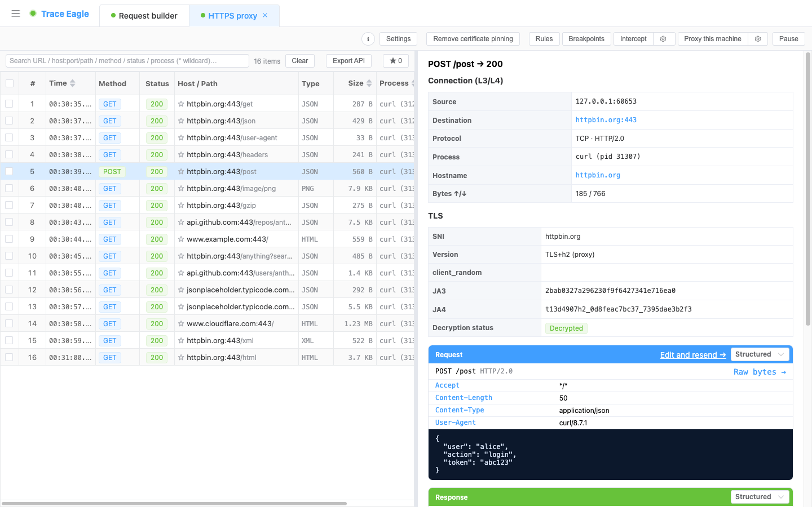

# 快速开始

> 本篇带你几分钟内跑通一次抓包：装好、启动，用最省事的方式抓下并**看懂第一条解密请求**，再帮你挑一条适合自己目标的抓法。看完就能上手。

---

## 一、装好并启动

1. 下载对应平台（macOS / Windows / Linux）的桌面应用并安装。
2. 打开应用。首次启动可能会请求系统权限（底层抓包需要），同意即可。
3. 打开就能用，无需额外配置。

---

## 二、最快的一次成功：抓你自己的浏览器

想立刻看到效果，用 [指定程序抓包](04-指定程序抓包.md)：由工具把浏览器替你启动起来，只抓这一个程序、全程自动解密，**不用配代理、也不用装证书**。

1. 新建会话，选 **「本机指定程序抓包」**。
2. 点内置的 **浏览器示例**（自动填好启动命令），或在「启动命令」里填你自己的命令。
3. 点 **开始**，工具会拉起一个独立、干净的浏览器窗口。
4. 在浏览器里随便打开一个网站，请求立刻出现在列表里。点开就是解密后的明文：请求行、请求头、body，响应也一样。

> 第一次就想跑通，就走这条路——不碰系统代理、不装证书，最省事，适合先感受一下「抓到即明文」。详细步骤见 [指定程序抓包](04-指定程序抓包.md)。

---

## 三、选一种适合你的抓法

不同目标用不同抓法，对着下表挑一条：

| 你想抓什么 | 用哪种抓法 |
| --- | --- |
| 本机浏览器 / 程序，还想改包、重放 | [代理抓包](02-代理抓包.md) |
| 整机全部流量，含不走代理的、UDP / QUIC、DNS | [网卡抓包](03-网卡抓包.md) |
| 只抓某一个程序，自动解密、免证书 | [指定程序抓包](04-指定程序抓包.md) |
| App 绑了证书（Pinning）、走自研加密，解不开 | [应用层抓包](05-应用层抓包.md) |
| 系统自带 App、顽固应用 | [系统级抓包](06-系统级抓包.md) |
| iPhone / iPad 的流量 | [iOS 抓包](07-iOS抓包.md) |
| 安卓手机的流量 | [Android 抓包](08-Android抓包.md) |

拿不准就先用 [代理抓包](02-代理抓包.md)：最通用，既能出明文、又能改包重放，还能顺带抓手机和局域网设备。

---

## 四、看懂界面

- **请求列表**：每条抓到的流量按顺序出现在这里，点选就展开详情。
- **自动解密**：某条流量的会话密钥可用时，工具自动把密文解成明文；详情里 TLS 会显示「已解密」。
- **原始与明文并排**：既能看解密后的请求 / 响应，也能看底层原始字节。
- **进程归属**：每条流量都标注是哪个程序发的，混在一起也能一眼认出。

抓到之后怎么读、怎么切换视图、怎么解码，见 [数据查看与解码](11-数据查看与解码.md)；两条请求找差异，见 [请求对比](13-请求对比.md)。

---

## 五、抓不到 / 解不开？先查这几条

| 现象 | 多半是 | 怎么办 |
| --- | --- | --- |
| 一条请求都没有 | 目标不走系统代理 | 改用 [网卡抓包](03-网卡抓包.md)，网卡层什么都抓得到 |
| 抓到了，但全是密文 | 没装证书，或 App 绑了证书 | 装证书（见 [证书安装](09-证书安装.md)），或改用 [应用层抓包](05-应用层抓包.md) |
| 手机装了证书还是抓不到 | 高版本系统不信任用户证书 | 见 [Android 抓包](08-Android抓包.md) / [iOS 抓包](07-iOS抓包.md) 里的免装证书抓法 |
| HTTP/3 / QUIC 看不到 | 走的是 UDP，普通代理看不见 | 用 [网卡抓包](03-网卡抓包.md) 配合 H3 解密 |

更细的排查也可以先跑一遍 [网络诊断](19-网络诊断.md)。

---

## 六、接下来

抓到、解开、看懂之后，这些是日常高频会用到的：

- [规则改写与断点拦截](16-规则改写与断点拦截.md)：不改代码就改请求和响应，或把请求半路拦下来手动改。
- [请求构造与重放](17-请求构造与重放.md)：任意请求改了再发，带签名、时间戳的接口也能真正重放。
- [会话重放与压力测试](18-会话重放与压力测试.md)：一串请求成批重放，或对单条接口就地压测。
- [生成代码与导出接口文档](15-生成代码与导出接口文档.md)：一条请求转多语言代码，整段会话反推出 OpenAPI 文档。
