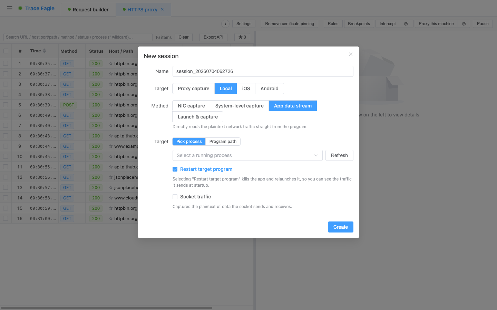
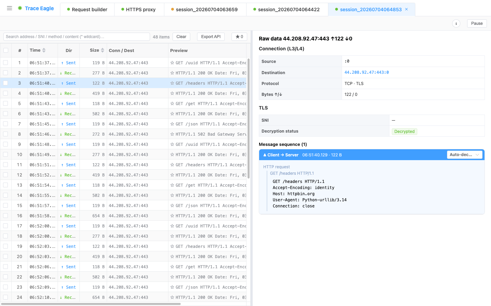

# 应用层抓包

> 本篇教你用「应用层抓包」抓下**一个正在运行的程序**——**直接从它内部取明文**。它做了证书绑定、根本不认代理、或者用了自研加密都没关系：不装证书、不配代理、不抓网卡，这些「设防」对它统统失效，照样看到它真正收发的内容。这是普通抓包工具最典型的盲区。

---

## 一、什么时候用这种抓法

代理和网卡都拿目标没办法时，换这条路。适合你满足下面任一条：

- 目标程序**已经在运行**，不方便重启、也不想改它任何设置，想就地看它在发什么。
- 目标做了**证书绑定（Pinning）**，代理一接管就连不上、报错。
- 目标**根本不认系统代理**，配了代理一条流量都抓不到。
- 目标走的是**自研 / 非标准加密**，网卡抓到也只有一堆密文、解不开。
- 目标**直接用操作系统自带的加密库**通信（这类往往是别处最头疼的盲区）。

如果目标只是一个**能用命令启动的常规程序**（浏览器 / 脚本 / CLI），[指定程序抓包](04-指定程序抓包.md) 更省事；如果 macOS 上的**系统自带 App 或格外顽固、藏得很深的应用**拒绝一切外部介入，改用 [系统级抓包](06-系统级抓包.md)。

---

## 二、前置条件

- 已安装并启动 TraceEagle（首次启动同意系统权限即可）。
- 目标程序**已经在运行**（认得出它的名字即可）；或者你手上有它的**程序路径**，让工具替你启动。
- **无需**装证书、**无需**改系统代理、**无需**动目标程序的任何配置。

---

## 三、开始抓：三步取到明文

1. 新建会话，选择 **「本机应用层抓包」**。
2. 选目标：
   - **对正在运行的程序直接下手**——从进程列表里**选中一个正在跑的程序**，就地从它内部取明文，不必重启、不必改它任何设置。
   - 也可以**填程序路径**，让工具替你把它启动起来。
3. 点 **开始**。工具会从目标程序内部读出它收发的明文，按方向（**Sent ↑ / Rec ↓**）实时逐条列出。

> 让目标程序产生网络请求（点一下、刷新一下、发一次消息），明文就会实时出现在列表里。

**两个可选开关，遇到硬骨头再打开：**

- **重启目标（抓启动初期）**：很多鉴权、握手就发生在程序**刚启动**的瞬间。勾上它，让目标先关掉再由工具拉起，就能把这段**启动初期**的流量也一并抓到，不错过关键的第一个请求。
- **socket 流量（更底层的兜底）**：遇到**精简过、去掉符号、或用较新技术栈编写**的程序，普通方式找不到它的加解密入口时，打开这个开关，它**换一条更底层的路**取数据、照样解出明文。很多方式彻底没辙的程序，这一手能拿下。

---

## 四、验证：确认取到明文了

在列表点开任意一条，看详情：

- **有收发记录**：按 **Sent ↑ / Rec ↓** 分方向列出，条目在实时增加。
- **是明文，不是密文**：详情里能看到完整、可读的内容（如 JSON、HTTP 请求头），不是一堆乱码。

不挑加密库、不挑技术栈——浏览器、桌面客户端、各类跨平台框架写的应用、原生程序，很多在别处「只有密文」的目标，这里直接是明文。

---

## 五、抓不到 / 解不开？逐条排查

| 现象 | 多半是 | 怎么办 |
| --- | --- | --- |
| 选中了程序，但一条收发都没有 | 目标此刻没产生网络请求；或它启动那一刻就把关键流量发完了 | 先让它动起来（点一下、刷新、发条消息）；抓不到启动流量就勾 **「重启目标」**，由工具拉起后从头抓 |
| 有流量，但普通方式定位不到它的加解密入口 | 目标精简过、去了符号、或用较新技术栈编写 | 打开 **「socket 流量」** 走更底层兜底，照样解出明文 |
| 程序多窗口 / 多进程，只抓到一部分 | 默认只针对选中的那一个程序，不自动展开它的全部子进程 | 把其它进程 / 窗口**分别选一次**，各开一路 |
| 完全选不中 / 进不去（多为 macOS 系统自带 App） | 目标是系统自带 App、或格外顽固、藏得很深的应用，拒绝一切外部介入 | 改用 [系统级抓包](06-系统级抓包.md)（不进入程序，从系统底层观测） |
| 只是想图省事抓个常规程序 | 目标本来就能用命令启动、也认代理 | 用 [指定程序抓包](04-指定程序抓包.md) 或 [代理抓包](02-代理抓包.md) 更轻便 |

---

## 六、本机四种抓法怎么选

| 你的情况 | 用哪种 |
| --- | --- |
| 程序已在运行 / 证书绑定 / 不认代理 / 自研加密 / 系统加密库 | **应用层抓包**（本篇） |
| 能用命令启动的常规程序（浏览器 / 脚本 / CLI） | [指定程序抓包](04-指定程序抓包.md)（更省事） |
| 想看整机全部流量、非 HTTP 流量 | [网卡抓包](03-网卡抓包.md) |
| macOS 上的系统自带 App / 顽固应用 | [系统级抓包](06-系统级抓包.md) |

---

## 下一步

- 从内部取到的明文，走的是和其它抓法**同一套处理**——怎么读、怎么切换视图、怎么解码：见 [数据查看与解码](11-数据查看与解码.md)。
- 遇到私有 / 自研的 socket 协议、想自己教它怎么读：见 [自定义协议解码](14-自定义协议解码.md)。
- 目标就是卡在证书绑定上：也可以先试试 [解除证书绑定](10-解除证书绑定.md)。
- 想改请求再发、或半路拦下来手动改：见 [请求构造与重放](17-请求构造与重放.md)、[规则改写与断点拦截](16-规则改写与断点拦截.md)。
