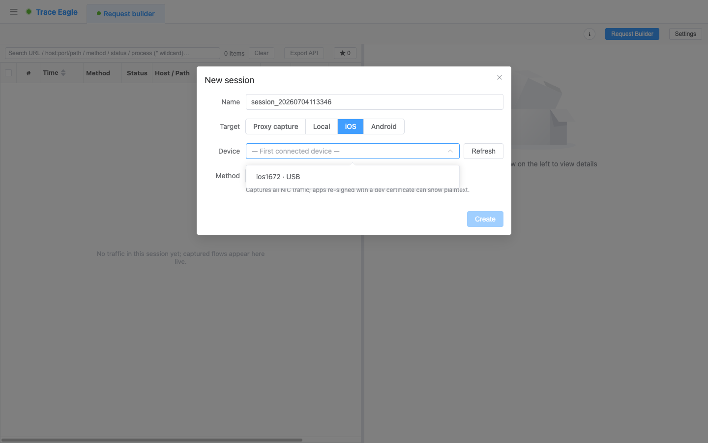
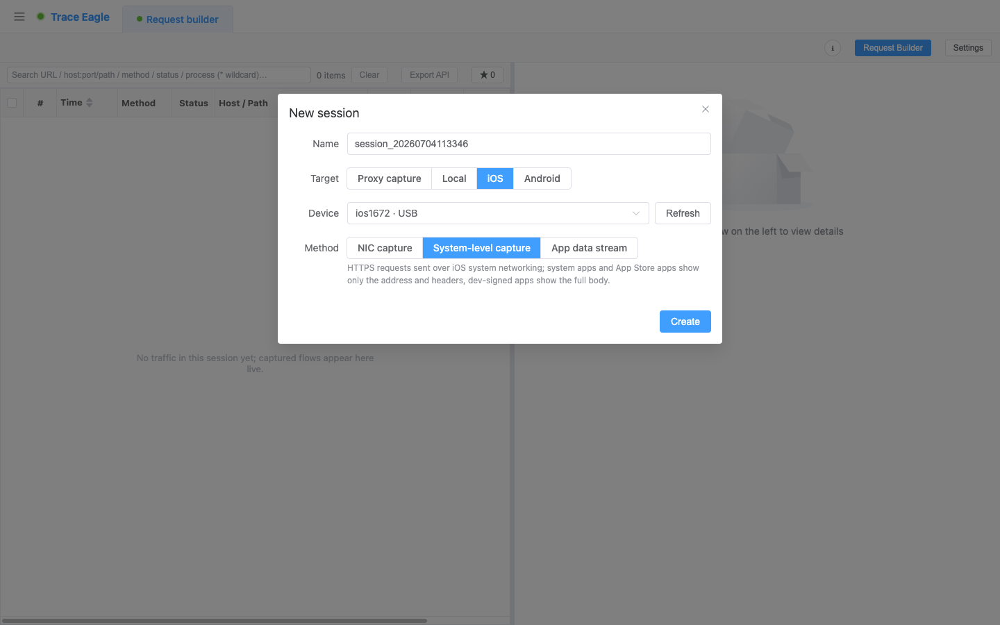
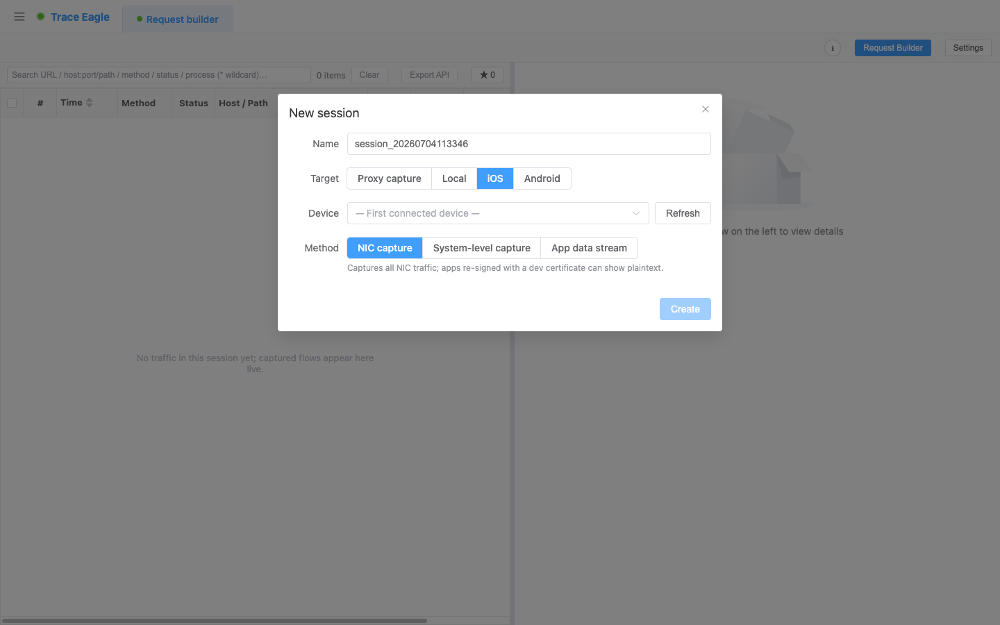
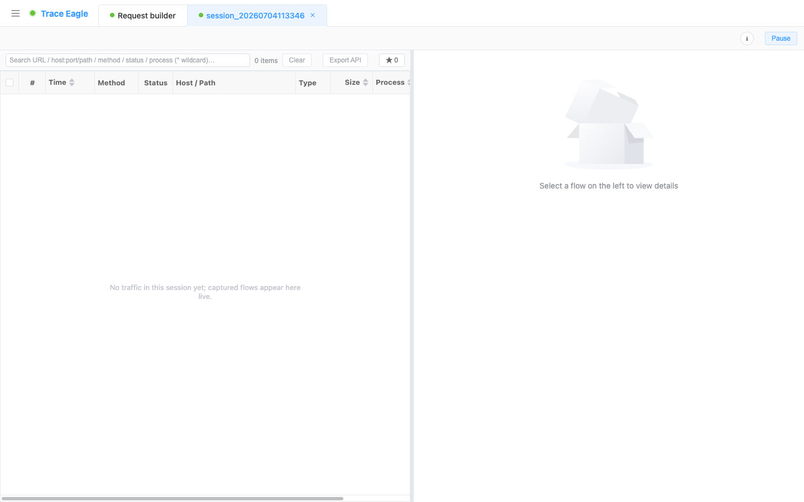

# iOS 抓包

> 本篇教你在 **iPhone / iPad** 上抓包：一根数据线连上电脑，选好方式就能开抓——**全程不用越狱**。从「零配置看系统请求」到「整机全量」再到「单个 App 完整明文」，三种方式各有各的步骤，本篇一步步带你做完。

---

## 一、什么时候用、三种方式怎么选

iOS 抓包在「新建会话」里选 **「iOS」** 后，会让你三选一。先对着下表挑好你要用的那种，再照对应小节操作：

| 你的目标 | 用哪种 | 能看到什么 | 要不要装证书 / 重签 |
| --- | --- | --- | --- |
| 快速看这台设备发了哪些 HTTPS 请求（地址 / 状态 / 头） | **系统级抓包** | 普通 App 也能看到请求地址与头（Body 看不到） | 只装一个设备诊断描述文件 |
| 整机全部流量（含非 HTTP、握手 / SNI） | **网卡抓包** | 全量数据，默认是密文，可对指定 App 定点解密 | 看密文不用；要解某 App 的明文才需重签 |
| 某个 App 的**完整明文收发（含 Body）** | **应用层抓包** | 单个 App 的完整明文 | 目标 App 需用开发证书重签名 |

> **系统级抓包最省心**：普通 App、App Store 应用也能看到它请求了哪些 HTTPS 地址——不用装 CA 证书、不用设代理、不怕证书绑定。想快速排查「这个 App 到底连了哪些接口」，从它入手。

除以上三种，iPhone / iPad 也能用 [代理抓包](02-代理抓包.md)：把设备 Wi‑Fi 代理指向本机、装上根证书，即可像电脑一样抓 HTTPS 明文，并用改写、重放等完整能力。适合调试走系统代理的 App。

---

## 二、前置条件（三种方式通用）

- 已安装并启动 TraceEagle（首次启动同意系统权限即可）。
- **用数据线把 iPhone / iPad 连上电脑**，设备上弹出提示时点 **「信任」**。
- **无需越狱**：三种方式都面向非越狱设备。
- **较新系统也支持**：iOS 17 及以上依旧能正常连接与抓包。
- 按方式准备证书 / 重签（没有先不急，用到时工具会引导）：
  - **系统级抓包**：需装一个**设备诊断描述文件**（一次即可）。
  - **网卡抓包**：只看密文与地址**不用**证书；要解出某 App 的明文，才需把该 App 用**开发证书重签名**。
  - **应用层抓包**：目标 App 需用**开发证书重签名**（App Store 与系统 App 需先重签才能作为目标）。
  - 装证书 / 描述文件的具体步骤见 [证书安装](09-证书安装.md)。

---

## 三、选设备：三种方式的共同第一步

1. 新建会话，**「目标」** 选 **「iOS」**。
2. 在 **「设备」** 下拉里选中你的手机；刚插上没看到就点 **「刷新」**。同一台设备若同时出现在网络里，按 **USB / 网络** 认准 USB 那条最稳。

3. 在 **「方式」** 里选 **网卡抓包 / 系统级抓包 / 应用层抓包** 之一，然后往下看对应小节。

---

## 四、系统级抓包 —— 最省心，普通 App 也能用

想快速看清「这台 iPhone 都发出了哪些 HTTPS 请求」，又不想装 CA 证书、设代理、处理证书绑定，选这种。

1. 「方式」选 **「系统级抓包」**。
2. 若尚未装过**设备诊断描述文件**，按提示装一次（见 [证书安装](09-证书安装.md)）；装过就跳过。
3. 点 **「创建」** 开始，然后在手机上正常操作要观察的 App。

**能看到多少，取决于目标 App：**

- **普通 App、App Store 应用**：通常能看到**请求方法、完整 URL（HTTPS 也是明文地址）、状态码、请求头与响应头**。
- **开发证书签名的 App**：连**完整的请求 / 响应 Body** 也能看到。

---

## 五、网卡抓包 —— 看这台设备的一切

要看设备**整台的全部网络流量**——不限 App、不限协议，连非 HTTP 的 QUIC、自定义协议都在，选这种。

1. 「方式」选 **「网卡抓包」**。
2. 点 **「创建」** 开始。默认抓到的是**密文包 + 元数据**（目标地址、端口，以及 TLS 握手里的 SNI 主机名）——足以看清「这台设备连了哪些地方、用什么协议」。
3. **想看某个 App 的明文**：对该 App 勾选 **「解密此程序」** 即可解出它的明文；前提是这个 App 已用**开发证书重签名**（见 [证书安装](09-证书安装.md)）。

---

## 六、应用层抓包 —— 单个 App 的完整明文

要拿到**某一个 App** 收发的**完整明文（含 Body）**——它从 App 内部取数据，证书绑定也拦不住，选这种。

1. 「方式」选 **「应用层抓包」**。
2. 在 App 列表里选目标 App。列表里只有**用开发证书重签名过**的 App 可选，其余会置灰——要抓的 App 若是灰的，先重签（见 [证书安装](09-证书安装.md)）。
3. 想连**启动初期**的流量也抓到，可先**关掉目标 App、再点创建后重新打开它**。
4. 点 **「创建」** 开始，然后在手机上操作这个 App。
5. **解不出明文时**：打开 **「socket 流量」** 开关兜底——遇到常规方式取不到明文的 App，换一条更底层的路取数据。

---

## 七、验证：确认抓到了

创建后会打开一个会话标签页，在手机上操作对应 App，请求就会**实时出现在左侧列表**里。点开任意一条看详情：

- **系统级抓包**：能看到请求方法、完整 URL、状态码与请求 / 响应头（开发证书签名的 App 还能看到 Body）。
- **网卡抓包**：能看到目标地址、端口、SNI 主机名；对已勾「解密此程序」的 App，响应是可读明文。
- **应用层抓包**：请求行、请求头、Body 都在，响应是明文而非乱码密文。

---

## 八、连不上 / 抓不到？逐条排查

| 现象 | 多半是 | 怎么办 |
| --- | --- | --- |
| 「设备」下拉里看不到手机 | 没插好、没信任，或刚插上还没枚举到 | 换根数据线 / 换 USB 口，手机上点 **「信任」**，再点 **「刷新」** |
| 设备出现两条、选哪条 | 同一台设备同时在 USB 和网络里 | 优先选 **USB** 那条最稳 |
| 系统级抓包创建后一条都没有 | 设备诊断描述文件没装或没生效 | 按 [证书安装](09-证书安装.md) 装好描述文件，重新创建会话 |
| 系统级抓包只看得到地址和头、没有 Body | 目标是普通 App / App Store 应用 | 这是系统诊断日志的限制；要完整 Body 改用 **应用层抓包**（需先重签该 App） |
| 网卡抓包全是密文、看不到明文 | 没对目标 App 做定点解密 | 对该 App 勾 **「解密此程序」**；若勾不了，说明它还没用开发证书重签名，先重签（[证书安装](09-证书安装.md)） |
| 应用层抓包里目标 App 是灰的、选不了 | 该 App 未用开发证书重签名 | 先重签（App Store / 系统 App 都要先重签），见 [证书安装](09-证书安装.md) |
| 应用层抓包抓到了但解不出明文 | App 用了自研 / 静态链接的库 | 打开 **「socket 流量」** 开关兜底，换更底层的路取数据 |
| 想抓 App 刚启动那几秒的请求 | 会话是在 App 已经跑起来之后才开的 | 先关掉 App，创建会话后再重新打开它 |
| 装了证书 / 描述文件还是抓不到 | 描述文件没在手机「设置」里确认信任 | 到手机 **设置** 里完成对应描述文件 / 证书的信任，再重试；详见 [证书安装](09-证书安装.md) |

---

## 下一步

- 抓到之后怎么读、怎么切换视图、怎么解码：见 [数据查看与解码](11-数据查看与解码.md)。
- 想边看边改、改请求再发或半路拦下来手动改：见 [规则改写与断点拦截](16-规则改写与断点拦截.md)、[请求构造与重放](17-请求构造与重放.md)。
- 遇到私有 / 自研协议、想自己教它怎么读：见 [自定义协议解码](14-自定义协议解码.md)。
- 想在手机上像电脑一样抓 HTTPS 明文、用完整改写重放能力：见 [代理抓包](02-代理抓包.md) 配合 [证书安装](09-证书安装.md)。
- 抓安卓设备：见 [Android 抓包](08-Android抓包.md)。
