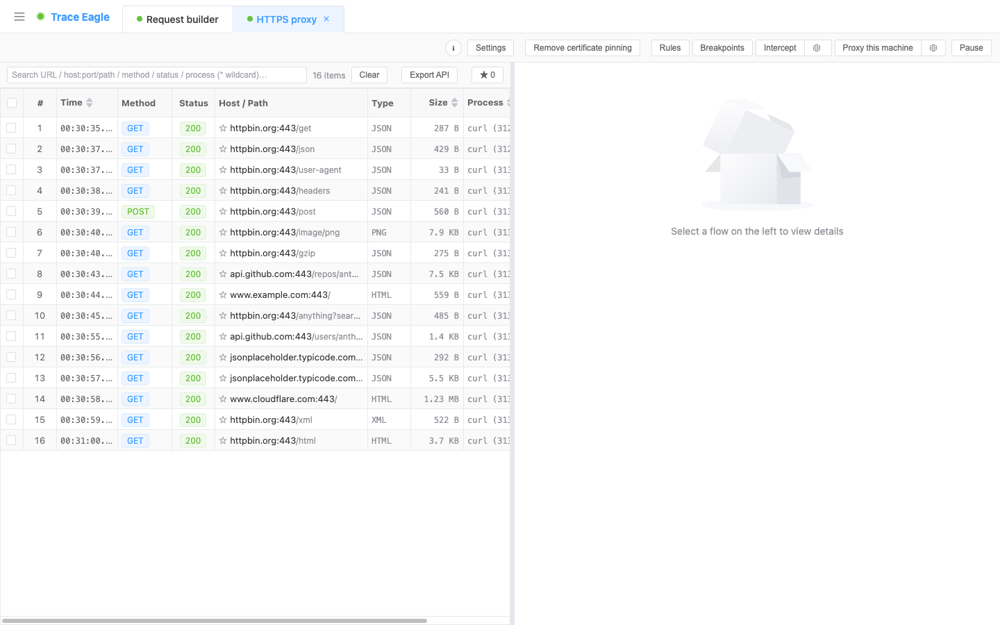

# Android 抓包

> 本篇教你在 Android 上一步步抓下手机 / 模拟器里的流量。Android 抓包最常卡在证书上——装了证书 App 却还是不认，做了证书绑定的更是直接抓不到。这里换个思路：**整机抓包 + 自动解密，全程不用在手机上装证书**；真机、模拟器都行，连做了绑定、走自研加密的 App 也能从内部拿到明文。跟着下面的步骤走，抓下第一条请求。

---

## 一、什么时候用、几种方式怎么选

先按你的设备和目标对号入座，再往下看对应的操作步骤：

| 你的情况 | 用哪种 | 要不要 root | 要不要装证书 |
| --- | --- | --- | --- |
| 老设备 / 模拟器 / 拿不准新旧，想最稳 | **网卡密钥**（推荐默认） | 需要 | 不用 |
| 较新的已 root 真机，想最省事 | **网卡抓包** | 需要 | 不用 |
| 只盯某一个 App，或它在整机模式下只出密文 | **应用层抓包** | 需要 | 不用 |
| 设备没 root，或想边看边改（改写 / 重放） | **代理抓包** | 不用 | 要装（见第二节） |

- 前三种都是**整机 / 定点抓包 + 自动解密、不用在手机上装任何证书**——这正是它们在 Android 上比传统代理抓包省心的地方。
- **拿不准就先用「网卡密钥」**：它兼容性最好，几乎任何已 root 设备都能用。
- 只有走**代理抓包**这条路才需要装证书；下面第二节会讲清高版本安卓的证书难题怎么绕开。

---

## 二、前置条件

**通用准备（真机）**

1. 用数据线把手机连上电脑，在手机上开启 **USB 调试**（「开发者选项」里）。
2. 首次连接时手机会弹「是否允许 USB 调试」，点**允许**。
3. 启动 TraceEagle，设备会出现在可选设备列表里。**模拟器无需插线**，通常会被自动识别。

**关于 root**

- 前三种抓法（网卡密钥 / 网卡抓包 / 应用层抓包）都需要**已 root** 的设备。模拟器一般自带或可一键开启 root，正好满足。
- 这三种都**不用在手机上装证书**：它们不是中间人代理，不靠手机信任证书来解密。抓包所需的辅助组件会**按设备架构自动下载并缓存**，你不用手动配环境。

**关于证书（只有代理抓包才需要）**

- 只有走**代理抓包**时才要在手机上装根证书。而高版本安卓**默认不信任用户装的证书**——这也是很多人「装了证书还是抓不到」的根因。
- 两种应对：① 设备已 root 时，可让工具**自动把信任证书装到系统层**，省去手动步骤；② 干脆不装证书，改用上面免证书的整机抓法（网卡密钥 / 网卡抓包）。装证书的完整步骤见 [证书安装](09-证书安装.md)。

---

## 三、网卡密钥：整机抓包（推荐默认）

抓设备网卡（默认 Wi-Fi）的**全部流量并自动解密**，不用挑 App、不用装证书。兼容性最好，老设备、各类模拟器都能用。

1. 在设备列表里**选中目标设备**（真机或模拟器）。
2. 抓包方式选 **「网卡密钥」**。
3. 选要抓的**网卡**，一般保持默认的 **Wi-Fi** 即可。
4. 点 **开始**。
5. 在手机上正常操作 App，产生网络请求，流量会实时出现在请求列表里。

> 模拟器的系统内核往往较老、不一定支持「网卡抓包」——这时直接用「网卡密钥」最稳，它对模拟器兼容性最好。

---

## 四、网卡抓包：整机抓包（较新真机，最省事）

同样抓设备网卡的**全部流量并自动解密**，特点是**自包含、最省事**（数据和解密所需信息打包在一起）。

1. 选中目标设备。
2. 抓包方式选 **「网卡抓包」**。
3. 选网卡（默认 **Wi-Fi**）。
4. 点 **开始**，在手机上产生请求即可看到实时流量。

> **前提是较新的设备（新内核）。** 若设备偏老不满足，开抓时会明确提示「网卡抓包不支持」——照提示改用**网卡密钥**即可。

---

## 五、应用层抓包：只盯一个 App，直接取内部明文

针对**单个目标 App**，**直接从它内部取明文**——证书绑定、自定义加密都拦不住。整机模式下解不出的那类 App，用这个定点拿下。

1. 选中目标设备。
2. 抓包方式选 **「应用层抓包」**。
3. 指定要抓的 App：从**已装 App 列表**里选，或填**包名 / 进程名**；**留空则抓当前前台 App**。
4. 想抓 App **启动初期**的流量，就勾上 **「重启目标程序」**（会先关掉再重新拉起它）。
5. 点 **开始**，操作那个 App 即可看到它的请求。

> **常规方式取不到明文时**（静态链接 / 自研库那类顽固 App），打开 **「socket 流量」** 开关兜底，换一条更底层的路取数据。

---

## 六、代理抓包：没 root，或想边看边改

设备没 root、或你需要对请求做**规则改写 / 重放**时，走代理这条路：把手机 Wi-Fi 代理指向本机、装上根证书，就能像电脑上一样抓 HTTPS 明文，并用上改写、重放等完整能力。

1. 在手机 Wi-Fi 设置里，把**代理**指向本机（工具会给出地址和端口）。
2. 在手机上**装根证书**：一般扫码一键安装，详见 [证书安装](09-证书安装.md)。
3. 若是高版本安卓、App 不认用户证书：设备已 root 时让工具把证书装到系统层；遇到 App 做了证书绑定，见 [解除证书绑定](10-解除证书绑定.md)。
4. 回到工具开抓，在手机上操作 App 即可。

---

## 七、验证：确认抓到并解密了

在请求列表点开任意一条，看详情：

- **能看到请求**：请求行、请求头、body 都在。
- **TLS 显示「已解密」**：响应是可读明文（如 JSON），不是乱码密文。

整机抓法（网卡密钥 / 网卡抓包）下，大多数 App 的 HTTPS 会**直接呈现明文**；少数用自带 / 非标准加密组件的 App 可能只出密文，改用**应用层抓包**定点解决。

---

## 八、抓不到 / 解不开？逐条排查

| 现象 | 多半是 | 怎么办 |
| --- | --- | --- |
| 设备根本不在列表里 | 没开 USB 调试，或没点「允许」 | 手机上开启 USB 调试并允许本机；模拟器重启一次多半就被识别 |
| 提示「网卡抓包不支持」 | 设备内核偏老，不满足网卡抓包前提 | 改用 **网卡密钥**，它不挑内核 |
| 抓到流量，但某个 App 只有密文 | 这个 App 用了自带 / 非标准加密组件 | 对这个 App 改用 **应用层抓包**，从内部取明文 |
| 应用层抓包也取不到明文 | 目标是静态链接 / 自研库的顽固 App | 打开 **「socket 流量」** 开关兜底 |
| 只想抓 App 一启动的那几条，却总错过 | 抓的时候 App 已经起来了 | 应用层抓包里勾 **「重启目标程序」**，抓它启动初期的流量 |
| 装了证书，代理下仍抓不到 HTTPS | 高版本安卓默认不信任用户证书，或 App 做了证书绑定 | 已 root 就让证书装到系统层，或干脆改用免证书的**网卡密钥 / 网卡抓包**；证书绑定见 [解除证书绑定](10-解除证书绑定.md) |

---

## 下一步

- 抓到之后怎么读、怎么切视图、怎么解码：见 [数据查看与解码](11-数据查看与解码.md)。
- 想改请求再发、或半路拦下来手动改：见 [请求构造与重放](17-请求构造与重放.md)、[规则改写与断点拦截](16-规则改写与断点拦截.md)。
- 遇到 App 的证书绑定：见 [解除证书绑定](10-解除证书绑定.md)。
- 抓 iPhone / iPad：见 [iOS 抓包](07-iOS抓包.md)。
