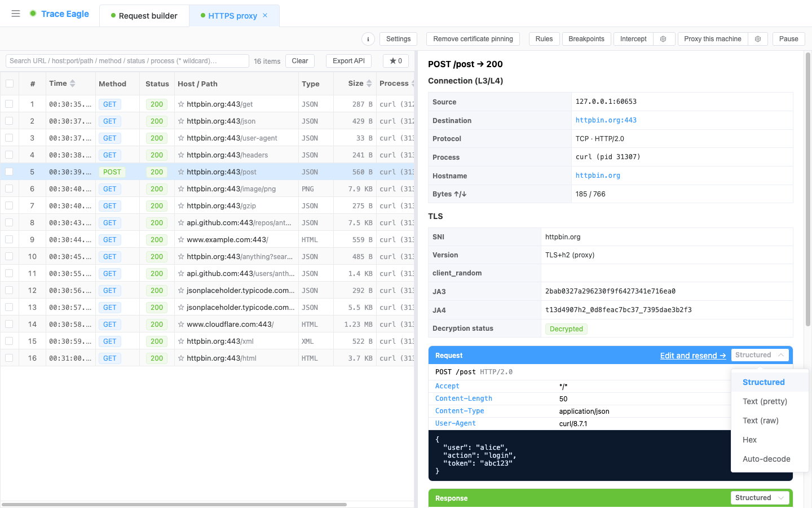
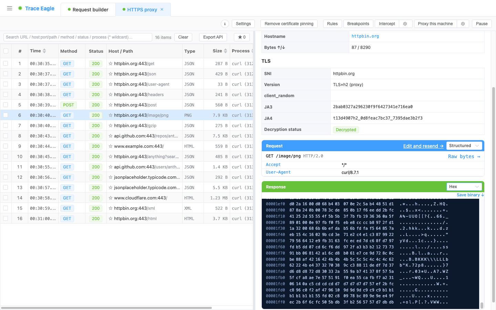
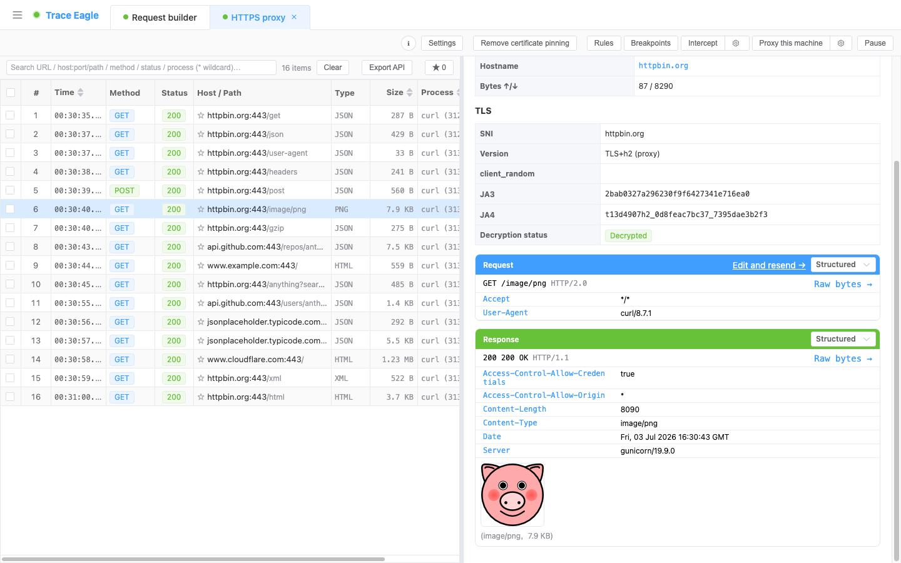

# 数据查看与解码

> 抓到只是开始，**看懂**才算数。本篇教你点开一条请求后怎么读：请求、响应两侧各自切换查看方式（结构化 / 文本美化 / 十六进制 / 自动识别），压缩的自动解开、JSON/XML/表单/protobuf 自动美化、图片视频音频直接在详情里预览。大多数时候你**什么都不用设**，点开就是最易读的样子；碰到乱码，本篇末尾也告诉你下一步怎么做。

---

## 一、什么时候用

- 抓到流量后，想**逐条读明白**请求头、body、响应到底发了什么。
- 响应打开是一堆压缩字节或看着像乱码，想**换个视图**看清楚。
- 想把某条数据当成 JSON / 十六进制 / 原始报文来对照着看。
- 抓到的是图片、视频、音频、PDF 等，想**直接预览**而不是另存再打开。

如果面对的是非 HTTP 的私有 / 二进制协议、按标准视图仍拆不开，转 [自定义协议解码](14-自定义协议解码.md)。

---

## 二、前置条件

- 已经抓到至少一条流量（还没抓到先看 [快速开始](01-快速开始.md) 或 [指定程序抓包](04-指定程序抓包.md)）。
- 想看 HTTPS 明文，需要这条已解密（详情里 TLS 显示「已解密」）。未解密的连接也能看，但只能看到原始收发字节。
- **无需**任何额外配置，查看与解码都是点开即用。

---

## 三、分步操作

### 1. 打开详情

在请求列表点开任意一条，进入详情。上半区是**请求**、下半区是**响应**，两侧**各自独立**，互不影响。

### 2. 选查看方式（「查看为」）

每一侧顶部都有一排查看方式，按需切换：

- **结构化**：起始行 + 请求头表格 + 智能 body，默认视图，先看它。
- **文本·美化**：按内容类型自动缩进、格式化——JSON、XML、表单（`x-www-form-urlencoded`）一键排版易读。
- **文本·原样**：完整报文按文本原样展示，一个字节不改。
- **十六进制**：hex 查看器，显示偏移，hex 与 ASCII 并排联动高亮，可一键保存为二进制文件；超大数据也能流畅查看、不卡顿。
- **自动识别**：交给引擎深度解码，渲染成可逐层展开的解码树——压缩里套压缩、帧里套帧，都能一层层钻进去。

请求这侧想看原样、响应那侧想看结构化，分别点各自的按钮即可，两边可以是不同视图。

> 小贴士：「查看为」只切换**表示层**。JSON、XML、表单不是单独的按钮，它们属于「文本·美化」自动处理的格式，选「文本·美化」就会自动认出并排版。

### 3. 让它自动解压、自动美化

大多数情况你**不用做任何事**：

- 响应被 gzip / brotli(br) / deflate / zstd 压缩过，会**自动解开**再展示；多层叠加编码（如 `gzip, br`）也会从外到内逐层解。
- body 是 JSON / XML / 表单 / protobuf / gRPC，会**自动识别并美化**，protobuf/gRPC 无需 `.proto` 也能解出字段号、类型、值。

### 4. 用十六进制看原始字节

想核对原始字节、或数据本身就是二进制时，切到 **十六进制**。点某个字节，hex 与右侧 ASCII 会联动高亮；需要留档时点保存，导出为二进制文件。

### 5. 预览媒体

body 是图片、视频、音频时，详情里**直接内联预览 / 播放**，并标注类型与大小，不用另存再开。

---

## 四、验证：确认读到的是明文

一条读对了，应该是这样：

- **结构化**视图里请求行、请求头、body 都在，字段清清楚楚。
- 压缩过的响应打开是**可读文本**（如缩进好的 JSON），不是一堆压缩字节。
- 是图片 / 视频等媒体，能在详情里**直接看到 / 播放**。
- 切到**十六进制**，偏移、hex、ASCII 三列对齐，点字节能联动高亮。

---

## 五、排错与技巧

| 现象 | 多半是 | 怎么办 |
| --- | --- | --- |
| 打开是一堆乱码 / 看不懂的字节 | 不是标准 HTTP body，可能是私有 / 二进制协议，或未解密的原始流 | 先切 **自动识别** 让引擎试解；仍拆不开就自定义解码，见 [自定义协议解码](14-自定义协议解码.md) |
| 响应像被压过、打不开 | 少见的多层或非常规编码 | 切 **自动识别**，逐层展开解码树；或切 **十六进制** 核对原始字节 |
| JSON / XML 挤成一行 | 当前在「文本·原样」或「结构化」下没美化 | 切到 **文本·美化**，自动缩进排版 |
| 只看得到原始收发字节、没有请求头 | 这条连接**未解密**（非 HTTP 或 TLS 没解开） | 确认详情里 TLS 是否「已解密」；解密相关见 [应用层抓包](05-应用层抓包.md) |
| 想核对一个字节都没改的原文 | 美化 / 结构化会重新排版 | 用 **文本·原样** 或 **十六进制**，两者都不改动原始内容 |
| 大响应打开有点重 | 数据体量很大 | 十六进制查看器对超大数据也能流畅翻看；需要留档就一键保存为二进制文件 |

小技巧：请求与响应两侧的视图**相互独立**，对照排查时可以一侧留结构化、另一侧开十六进制，同屏对着看。

---

## 下一步

- 私有 / 自研协议按标准视图拆不开，想自己教它怎么读：见 [自定义协议解码](14-自定义协议解码.md)。
- 两条请求哪里不一样，想逐行比对：见 [请求对比](13-请求对比.md)。
- 想拿这条数据改一改再发、或半路拦下来手动改：见 [请求构造与重放](17-请求构造与重放.md)、[规则改写与断点拦截](16-规则改写与断点拦截.md)。
- 想根据这条接口生成代码、导出文档：见 [生成代码与导出接口文档](15-生成代码与导出接口文档.md)。
