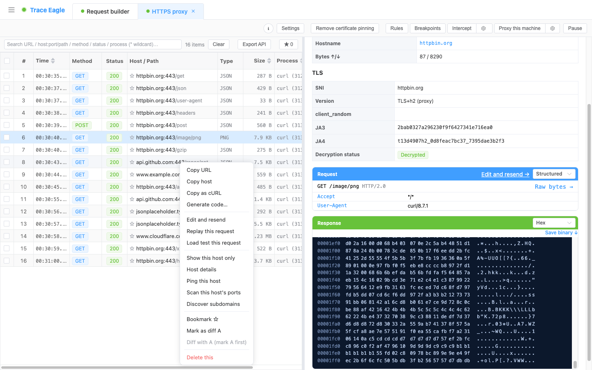
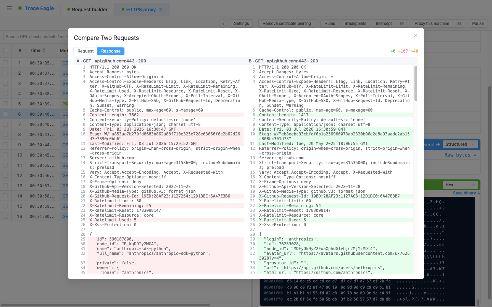

# 请求对比（Diff）

> 本篇教你把**两条请求 / 响应并排逐行比对**：选中一条标记为 A，再在另一条上「与 A 对比」，工具立刻弹出并排窗口，逐行标出每一处差异。「为什么这次成功、上次失败？」「同样的接口，成功和失败到底差在哪一行？」——一比就知道。两条记录**不必来自同一个会话**，跨会话、跨来源也能比。

---

## 一、什么时候用

适合你满足下面任一条：

- 想弄清**两条请求为什么表现不同**：成功 vs 失败、能通 vs 报错，到底差哪个头、哪个参数、哪段 body。
- 手动构造 / 重放出一条请求，想**和真实抓到的那条核对**——签名对不对、字段齐不齐。
- 改了服务端 / 客户端后，想确认**改动前后**这条请求或响应到底变了什么、有没有副作用。
- 测试环境和线上环境**同一接口**返回不一致，想快速定位是配置差异还是数据差异。

如果你还只抓到一条、手上没有第二条可比，先去多抓一条，或用 [请求构造与重放](17-请求构造与重放.md) 造一条出来再回来对比。

---

## 二、前置条件

- 已安装并启动 TraceEagle，并且**至少已经抓到（或构造出）两条流量**。
- 两条流量**在界面上都能看到即可**——不要求同一个抓包会话、也不要求同一时间抓的。
- 想比响应体时，确认那条流量的响应**已解密 / 可读**（详情里 TLS 显示「已解密」）；未解密的一侧对比时工具会直说。

---

## 三、分步操作：两步比出差异

1. 在任意一条流量上**右键**，在上下文菜单里点 **「标记为对比 A」**。这条就被记为对比的一方 A。
2. 找到要和它比的另一条流量（**同一会话里的、别的会话里的、构造器里重放后抓到的，都行**），在它上面**右键**，点 **「与 A 对比」**。

   

3. 一个并排对比窗口立刻弹出：左侧是 A、右侧是 B，各带标签（方法 · 主机 · 状态），一眼知道在比哪两条。
4. 在窗口顶部**一键切换**要比的是 **请求** 还是 **响应**。两边内容会同步切换。
5. 逐行看差异：**新增（+）、删除（−）、改动（~）**分别高亮，A 侧标红、B 侧标绿，改动行两边并排对照；顶部还给出「新增 / 删除 / 改动」的**行数汇总**。

   

> 对比覆盖一条报文的**全部**：起始行（请求行 / 响应行）、全部请求头 / 响应头、请求体 / 响应体。body 会**先自动美化再逐行比**，JSON、XML、表单都好读，真正变了的字段一眼看到，不被换行 / 缩进等格式噪声干扰。

---

## 四、验证：确认比对结果可信

打开对比窗口后，对照下面几点确认结果没歧义：

- **两侧标签对得上**：左 A 右 B，各自的方法 · 主机 · 状态和你想比的两条一致，没选错。
- **请求 / 响应切换正常**：顶部切到「请求」看请求头 body，切到「响应」看状态码和响应体，两边同步变化。
- **差异有标色、有计数**：改动行标了色，顶部行数汇总和你肉眼看到的差异对得上。
- **完全一致会明确提示**：两条内容相同时工具直接告诉你「一致」，不用自己逐行确认；某侧没内容或**还未解密**，也会直说，不让你干等。

---

## 五、技巧与排错

| 现象 / 想法 | 多半是 | 怎么办 |
| --- | --- | --- |
| 菜单里点了「与 A 对比」没反应 | 还没先标记 A | 先在一条上右键 **「标记为对比 A」**，再到另一条上 **「与 A 对比」** |
| 想比的两条在不同会话里 | 以为只能同会话内比 | 不必——只要两条都在界面上见得到就能比，A 和 B **可以跨会话、跨来源** |
| 响应侧一片空 / 提示未解密 | 那一条的响应还没解密或本就没 body | 先把那条流量解密好（详情 TLS 显示「已解密」）再比；参见 [数据查看与解码](11-数据查看与解码.md) |
| 想验证「我构造得对不对」 | 手造请求和真实请求没并排看 | 在 [请求构造与重放](17-请求构造与重放.md) 里重放 / 发出后抓到那条，再和历史真实请求「与 A 对比」，逐行核对签名与字段 |
| body 差异看着很多、其实只是格式不同 | 换行 / 缩进等格式噪声 | 不用担心——body 会先自动美化再比，标出来的是**真正变了的字段**，不是格式抖动 |
| 比错了两条 / 想换一条重比 | A 标记指向了旧的那条 | 在新的目标上重新右键 **「标记为对比 A」**，覆盖掉旧的 A，再选 B |

---

## 下一步

- 想先把某条流量读懂、解好码再来比：见 [数据查看与解码](11-数据查看与解码.md)。
- 想造一条请求 / 重放后抓到，用来和真实请求核对：见 [请求构造与重放](17-请求构造与重放.md)。
- 想看这条请求发给的是谁、对方什么来头：见 [主机详细信息](12-主机详细信息.md)。
- 私有 / 自研协议对比前要先能读懂：见 [自定义协议解码](14-自定义协议解码.md)。
