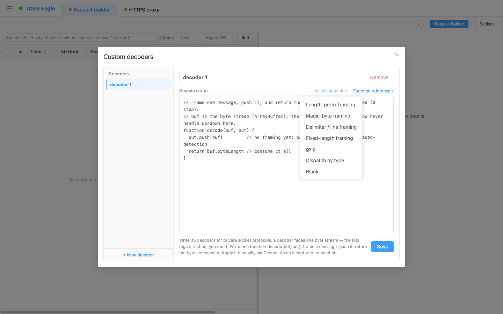

# 自定义协议解码

> 抓到一段私有 / 自研的 socket 协议，工具内置格式都认不出、数据查看里只剩一堆字节？这一篇教你**写一小段脚本，告诉工具怎么读它**——把连成一片的字节流切成一条条消息、剥掉协议头、需要时解压，剩下的交给工具自动识别成结构。脚本**改完保存即热生效**，不用重新抓包，同一条连接立刻按新规则重解。

---

## 一、什么时候用

先按 [数据查看与解码](11-数据查看与解码.md) 里的办法试着换视图、自动识别。如果一条连接**仍然是乱码**、任何内置格式都套不上，多半是它跑的是自研 / 私有协议——这时才轮到自定义解码器。典型信号：

- 抓到的是 **socket 长连接**，不是标准 HTTP，收发都是二进制字节。
- 常见形态是**长度前缀 + protobuf / JSON / 二进制**，或裹了一层自定义头、压过一道。
- 你**知道这段字节的格式**（自家协议、有文档、或已逆出结构），只差把规则写给工具。

如果只是标准格式没认出来，不必写脚本，先回 [数据查看与解码](11-数据查看与解码.md) 试自动识别。

---

## 二、前置条件

- 已安装并启动 TraceEagle，并已按前面几篇抓到了目标流量（这条私有连接已经在请求 / 连接列表里）。
- 手边清楚这段协议**怎么切帧**：一条消息从哪开始、长度写在哪、头有几个字节、要不要解压。
- 会一点 JavaScript 基础语法（能写 `if`、读整数、截取字节即可，不必精通）。
- 解码是对**已抓到的数据**做的，随时可反复重解——不用担心写错要重抓。

---

## 三、分步操作

### 1. 进入自定义编解码器

打开**自定义编解码器**编辑器（解码器管理入口）。这里能新建、命名、保存一份解码器清单，随时增改删。



### 2. 新建一个解码器

点**新建**，给它起个名字（例如「自家推送协议」）。整个解码器就是一个函数 `decode(buf, out)`——不想从空白写起，点**插入模板**选一个最接近你协议的骨架，改几个数字就能跑。

### 3. 写解析脚本

`decode` 的心智模型很简单：工具把这条连接的字节喂给你，反复问一句「从这里开始，能切出一条完整消息吗？」——你切出一条、告诉它用掉了多少字节，它就拿剩下的再问一次，直到切完。

```js
function decode(buf, out) {
  // buf：当前待解析的剩余字节流；out：输出收集器；return：这次消费掉的字节数
}
```

三个约定记住就够：

- **`buf`** 是剩余字节流。用 `buf.byteLength` 看还剩多少。它是原始缓冲，**不能直接 `buf[0]` 取字节**——用下面的辅助函数，或自己 `new DataView(buf)` / `new Uint8Array(buf)`。
- **`out.push(...)`** 推出**一条消息**，一次可以 push 多条。推的内容是辅助函数返回的字节段或字符串。
- **`return` 消费的字节数**：`> 0` 表示切出了一条、吃掉开头这么多字节，工具拿剩下的再调你；返回 `0`（或不写 `return`）表示「还凑不齐一条」，工具停下、把剩余字节按原样展示。**push 了就一定要配上对应的 `return`**，否则这次 push 会被丢弃。

方向不用你操心：发送流、接收流工具会**各跑一遍**你的脚本，并自动给切出的每条消息标好方向。你只管「怎么切」。

**脚本里直接能用的辅助能力**（省得自己造轮子）：

| 想做的事 | 写法 |
| --- | --- |
| 截取子段 | `sub(buf, off)` / `sub(buf, off, len)` → 返回字节段 |
| 读整数（大端 / 小端，无符号） | `u8(buf, off)`、`u16be` / `u16le`、`u32be` / `u32le` `(buf, off)` |
| 转文本 | `hex(buf)`（十六进制）、`ascii(buf)`（读成文本） |
| 判 / 解压 | `gzipMagic(buf)`；`gunzip` / `inflate` / `unzstd` / `lz4dtx` `(buf)`（解不动时原样返回） |
| 调试打印 | `log(...)` / `console.log(...)` → 打到「调试输出」面板 |

标准 JavaScript（`ArrayBuffer`、`Uint8Array`、`DataView`、`JSON`、`Math`、`RegExp` 等）也都能用。要把字节读成文本请用 `ascii(buf)`（沙箱里没有 `TextDecoder` / `fetch` / `setTimeout` 这类浏览器专有能力）。

几个最常见的写法，照着改数字就行：

**① 长度前缀 `[4 字节大端长度][负载]`**——最典型的私有协议：

```js
function decode(buf, out) {
  if (buf.byteLength < 4) return 0       // 长度头还没到齐，先等
  const total = 4 + u32be(buf, 0)        // 整条 = 4 字节头 + 负载
  if (buf.byteLength < total) return 0   // 整条还没到齐，先等
  out.push(sub(buf, 4, total - 4))       // 剥掉头，把负载交给自动识别
  return total                           // 用掉这一条，接着切下一条
}
```

**② 按换行 / 分隔符切帧**：

```js
function decode(buf, out) {
  const i = ascii(buf).indexOf('\n')
  if (i < 0) return 0                     // 还没遇到换行，等
  out.push(sub(buf, 0, i))               // 推这一行（不含换行）
  return i + 1                           // 连换行一起消费掉
}
```

**③ 整条一次性处理**（比如整包解压）：

```js
function decode(buf, out) {
  out.push(gzipMagic(buf) ? gunzip(buf) : buf)  // 是 gzip 就解开
  return buf.byteLength                          // 全部消费，循环随即结束
}
```

**④ 按类型字段分派**（头里带类型，不同类型不同处理）：

```js
function decode(buf, out) {
  if (buf.byteLength < 4) return 0
  const total = 4 + u32be(buf, 0)
  if (buf.byteLength < total) return 0
  const type = u8(buf, 4)                        // 首字节是消息类型
  const body = sub(buf, 5, total - 5)
  out.push(type === 2 ? gunzip(body) : body)     // 类型 2 是压缩过的
  return total
}
```

> 需要跨多次调用记点状态（计数、上一条的类型……），把变量写在 `decode` **外层**即可——它在同一条流的多次调用间保留，换方向或重新解码时自动重置。

### 4. 保存，热生效

点**保存**。脚本**即时生效**，不用重启、不用重新抓包。写坏了也不怕：脚本报错或超时只会「这次没解开、看到原始字节」，不会中断抓包、更不会丢数据，放心大胆改。

### 5. 应用到匹配的流量

回到请求 / 连接列表，在那条看不懂的连接上**右键 → 「解码为」→ 选你刚写好的解码器**。整条连接的收发会立刻按你的规则拆开展示。

---

## 四、验证：乱码变成结构

选完「解码为」，看结果区：

- **原本连成一片的字节流**，现在被切成了**一条条独立消息**，每条标着来自发送 `↑` 还是接收 `↓`。
- 你剥头 / 解压后 push 出去的负载，会被工具**再做一次自动识别**——里面是 protobuf / JSON / plist 就继续解成**结构化视图**，配合 [数据查看与解码](11-数据查看与解码.md) 的多视图对照着看。
- 没被切走的尾部字节（比如最后半条不完整的消息）不会丢，会作为一条原始数据留在末尾。

如果一次没拆对，改脚本、保存、再点一次「解码为」，同一条连接立刻用新规则重解——反复迭代到满意为止。

---

## 五、排错 / 技巧

| 现象 | 多半是 | 怎么办 |
| --- | --- | --- |
| 点了「解码为」，还是原始字节 | `decode` 全程返回了 `0`（没切出消息），或抛了异常 | 看结果**上方的「调试输出」面板**：报错、超时都会显示在那，并标明来自 `↑` / `↓`，照着改 |
| push 了消息却没显示 | push 之后返回了 `0`，这次 push 被丢弃 | 「推一条消息」一定要配上「返回它占了多少字节」（`return > 0`） |
| `buf[0]` 拿到 `undefined` | `buf` 是原始字节缓冲，不能下标取字节 | 用 `u8(buf, 0)` 等辅助，或 `new Uint8Array(buf)` / `new DataView(buf)` 包一层 |
| 想边写边看变量 | —— | 在 `decode` 里 `log(buf.byteLength)`、`log(hex(sub(buf, 0, 8)))` 打印任意值，输出进「调试输出」面板，比盲改快得多 |
| 消息被切多了 / 切少了一截 | 长度算错（漏算头长、大小端读反） | 核对 `total` 是否含头长；大端用 `u32be`、小端用 `u32le`，别读反 |
| 解压后仍是乱码 | 用错解压算法 | gzip 用 `gunzip`、zlib/deflate 用 `inflate`、zstd 用 `unzstd`、分块 LZ4 用 `lz4dtx`；解不动会原样返回，可用 `gzipMagic` 先判 |
| 改了脚本没变化 | 没保存，或没重新「解码为」 | 保存后再点一次「解码为」；解码是对已抓数据重跑，可无限次重解 |

---

## 下一步

- 拆成结构之后怎么读、怎么切视图：见 [数据查看与解码](11-数据查看与解码.md)。
- 还没抓到这条流量：socket / 私有协议常需从程序内部或网卡层取，见 [应用层抓包](05-应用层抓包.md)、[网卡抓包](03-网卡抓包.md)。
- 想拿两条消息逐字段比差异：见 [请求对比](13-请求对比.md)。
- 解出结构后想改字段再发：见 [请求构造与重放](17-请求构造与重放.md)。
