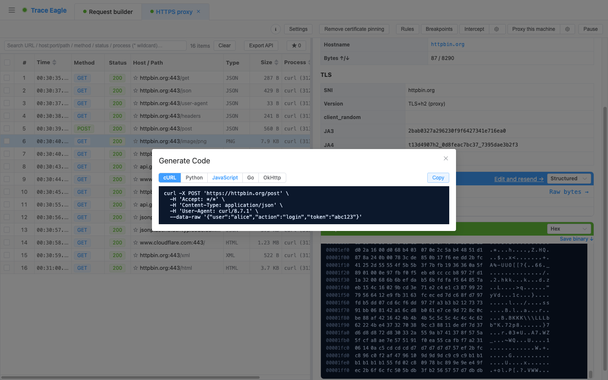
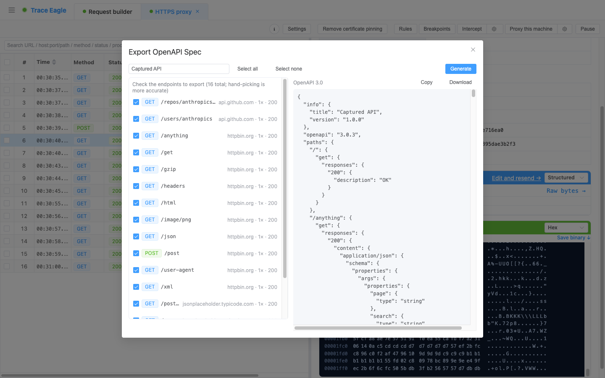

# 生成代码与导出接口文档

> 本篇教你把抓到的请求**变成产物**：一条请求一键转成能跑的**代码**（cURL / Python / JavaScript / Go / OkHttp），一整段会话自动归并成规范的**接口文档（OpenAPI）**，或导出成通用的 **HAR**；别处抓的会话文件也能**导进来**接着分析。不用手抄、不用手写，全从真实抓包直出。

---

## 一、什么时候用

适合你满足下面任一条：

- 想把抓到的一条真实请求**复现到脚本 / 工程**里，或发给同事（一条 cURL 谁都能跑）。
- 在请求构造器里调通了一个请求，想直接**导出成代码**接着开发。
- 抓完一段接口流量，需要一份可交付、可导入的 **OpenAPI** 接口文档——对接第三方、给后端补文档、给测试造用例。
- 想把这段抓包**导出成通用格式**（HAR）交付、归档，或转给别的工具。
- 手上有别人 / 线上 / 其它工具抓的会话文件，想**拉进来**借这里的解码、主机档案、请求对比继续看。

---

## 二、前置条件

- 已安装并启动 TraceEagle。
- 生成代码 / 导出 OpenAPI / 导出 HAR：先**抓到请求**（任意一种抓法都行，见 [快速开始](01-快速开始.md)），请求列表里有数据即可。
- 只做「导入外部会话」：无需先抓包，手上有对应的会话文件即可。

---

## 三、分步操作

### A. 单条请求生成代码并复制

1. 在请求列表里选中一条想复现或分享的请求。
2. **右键 → 「生成代码…」**。（也可以在 [请求构造与重放](17-请求构造与重放.md) 里调好一个请求后，点「生成代码」，导出方式一样。）
3. 在顶部**切换语言**，即时重新生成，共 5 种形式：
   - **cURL**（贴进终端就能跑）
   - **Python**
   - **JavaScript**
   - **Go**
   - **OkHttp**（Java / Kotlin）
4. 点 **复制**，粘进终端 / 工程 / 发给同事即可。

生成的代码是**完整**的：请求方法、URL、**全部请求头、请求体**一应俱全；请求头还**保持原顺序、允许重复**，原样保留，跑出来和真实请求一致。

> 普通工具生成代码常把请求头**重排、去重**，复现就走样了；这里原样保留，复现更保真。

### B. 整段会话导出 OpenAPI / HAR

**导出 OpenAPI（接口文档）**

1. 抓完一段接口流量后，打开 **导出接口文档（OpenAPI）**。
2. 它会**先分析、再导出**：从当前会话自动识别出接口，列成清单让你勾选。清单直接显示每个接口的**方法、路径、出现次数、见过的状态码**，一眼看清接口全貌。
3. **勾选**你要的接口（只导你选的、避免噪声）。工具会自动帮你：
   - **归并路径**：把带具体 ID 的路径模板化，例如 `/users/123` → `/users/{id}`，同一接口的多次请求合并成一条。
   - **推断结构**：合并请求 / 响应的 JSON 结构、按状态码归类响应、把路径变量整理成参数。
4. 右侧**实时预览**产出的标准 **OpenAPI 3.0** 文档，确认无误后点 **复制** 或 **下载**，导入任何支持 OpenAPI 的接口工具继续用。

**导出 HAR（通用交换格式）**

1. 在会话上选择 **导出 HAR**。
2. 整段抓包会一键导出为标准 **HAR 1.2** 文件，用于交付、归档，或转给别的工具接着分析。

### C. 导入外部会话

1. 选择 **导入会话**。
2. 选中要导入的文件——支持 **HAR 1.2**、`.pcap` / `.pcapng`，以及常见抓包工具导出的会话文件。
3. 导入后，别人抓的包就出现在请求列表里，可以照常**接着看、接着比、接着导**，也能用这里的解码与主机档案继续分析。

---

## 四、验证：确认拿到了产物

- **生成代码**：切换语言时预览会即时刷新；把 cURL 贴进终端能跑通、返回和抓到的一致，就说明请求头 / 请求体都完整带上了。
- **导出 OpenAPI**：勾选接口后，右侧预览里能看到方法、路径（已模板化成 `/{id}`）、参数与响应结构；复制 / 下载得到的是一份可被接口工具导入的 OpenAPI 3.0 文档。
- **导出 HAR / 导入会话**：导出后得到 `.har` 文件；导入外部文件后，请求列表里出现对应的请求条目，点开有完整详情。

---

## 五、技巧与排错

| 现象 | 多半是 | 怎么办 |
| --- | --- | --- |
| 生成的代码跑出来和真实请求不一致 | 手动改过请求头顺序，或漏带了某个头 | 直接对原始请求重新「生成代码」；这里默认原样保留请求头顺序与重复项，不用手动补 |
| 想要的语言不在里面 | 目前提供 cURL / Python / JavaScript / Go / OkHttp 五种 | 先导出最接近的一种（如 cURL），再按需转写 |
| OpenAPI 清单里混进了不相关的接口 | 会话里含有噪声流量 | 在「先分析、再导出」的清单里**只勾**你要的接口，不选的不会导出 |
| 相同接口被拆成了好几条 | 路径里带了具体 ID，未被归并 | 归并会把 `/users/123` 之类模板化成 `/users/{id}`；若仍分散，确认它们方法 / 路径结构一致 |
| 想把线上 / 同事抓的包拿来分析 | 数据不在本机会话里 | 用「导入会话」拉进 HAR 1.2 / `.pcap` / `.pcapng` 等文件，导入后照常查看、对比、再导出 |
| 想交付给别的工具，对方不认本工具格式 | 需要通用交换格式 | 导出 **HAR 1.2**（交付、归档、跨工具通用）或 **OpenAPI 3.0**（接口文档通用） |

---

## 下一步

- 生成代码前，先把请求看清楚、切换视图、解好码：见 [数据查看与解码](11-数据查看与解码.md)。
- 想调好一个请求再导出成代码，或改了再发：见 [请求构造与重放](17-请求构造与重放.md)。
- 导入的会话想和本地这份逐行比差异：见 [请求对比](13-请求对比.md)。
- 遇到私有 / 自研协议、导出前想先让它读得懂：见 [自定义协议解码](14-自定义协议解码.md)。
