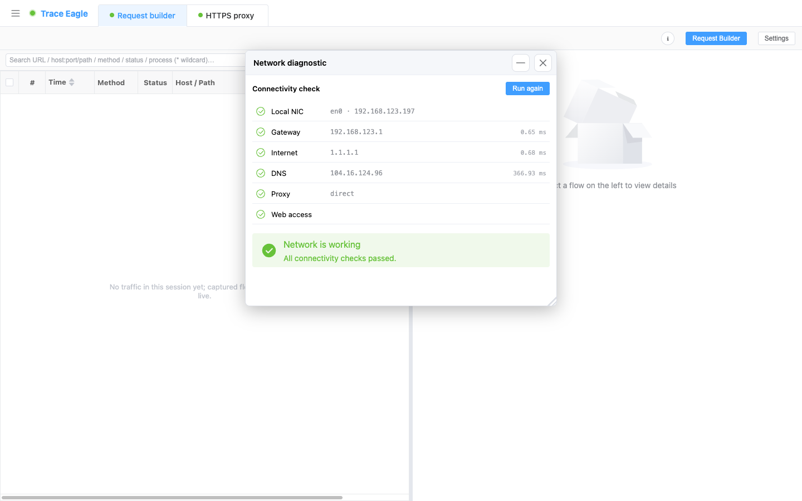
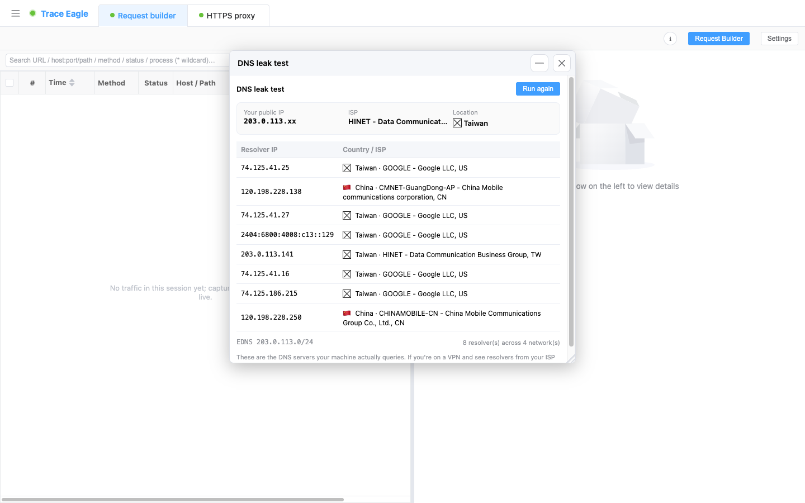

# 网络诊断

> 网突然不好使了，是网卡、路由器、宽带、DNS，还是代理出了问题、又或者被劫持到了登录页？本篇教你用内置的「网络诊断」一站式排查：**一键分层自检**直接告诉你卡在哪一层，还能盯**连通性**、查 **DNS 有没有泄漏**。抓不到、连不上时，先来这里跑一遍，比逐个手动试快得多。

---

## 一、什么时候用

碰到下面任一种情况，先来诊断：

- 突然断网，想**一步定位**是哪一环出问题，而不是一层层手动猜。
- **抓包停掉后应用集体上不了网**——多半是上次抓包留下的残留代理，这里一键就能清掉。
- 连了 Wi-Fi 却打不开网页，怀疑撞上了要先登录的认证门户。
- 想盯一条链路的延迟 / 抖动 / 丢包随时间怎么变；ICMP 被防火墙拦时用 TCP ping 测端口级可达。
- 用着 VPN / 代理，想核实 DNS 有没有跟着走隧道、本机到底在用谁家的 DNS。

如果是「明明在抓，请求列表却空空如也」，一般也是链路或代理出了问题，先跑一遍一键分层自检，再回到对应抓法排查。

---

## 二、前置条件

- 已安装并启动 TraceEagle（首次启动同意系统权限即可）。
- **无需**装证书、**无需**先配代理——诊断工具开箱即用。
- 想做连通性探测的话，准备好要盯的**目标主机**（域名或 IP）；想测端口级可达再备一个**端口号**（如 443）。

---

## 三、分步操作

下面分三个场景，按需选用：**A. 一键分层诊断**（先跑它定位卡点）、**B. 连通性探测**（盯一条链路）、**C. DNS 泄漏检测**（核实 DNS 走向）。

### A. 一键分层诊断：读懂每一层的结果

1. 打开 **「网络诊断」**，进入即自动开跑，从本机网卡一路查到网页访问，**逐层实时出结果**，每步都带状态（通过 / 警告 / 失败）。
2. 从上往下对着看这几层，哪一层亮警告 / 失败，问题就在那一环：
   - **本机网卡**：有没有可用的网卡和 IP。
   - **默认网关**：到路由器 / 局域网这一跳通不通——分清是「本地 / 路由器」还是「宽带 / 上游」的问题。
   - **公网连通**：不经 DNS、直接按 IP 探公网通不通（ICMP 被拦也能测）。
   - **DNS 解析**：域名能不能正常解析成 IP、解析多快。
   - **代理设置**：本机代理配置是否正常。
   - **网页访问**：能正常打开网页，还是被拦截 / 撞上需要登录的**认证门户**（连了 Wi-Fi 却要先登录那种）。
3. 看最下面的**总体结论 + 修复建议**：它会直接点明是「网卡 / 路由器 / 宽带 / DNS / 代理 / 认证门户」哪一环，不用你逐层猜。
4. 处理完想复测，点 **「重新检测」** 再跑一遍。

> **抓包一停就断网**时，这一步就是最快的自救：诊断会**自动识别并清除残留代理**（工具改过系统代理后异常退出、留下一个指向已关闭端口的代理，会导致应用集体断网却查不出原因），本机与系统 / 浏览器两头一起清，并提示「已恢复」；正在正常使用中的代理只报告、不乱动。

### B. 连通性探测：某台主机通不通、延迟多少

1. 新建一个**连通性探测**，填入要盯的**目标主机**（域名或 IP）。
2. 选**探测方式**：
   - **ICMP ping**：传统 ping，开箱即用。
   - **TCP ping**：向指定端口（如 443）探测，**ICMP 被防火墙拦时照样测出「端口级」可达性**。
3. 需要的话调**探测间隔**：高频盯抖动，或低频长时间守一条链路；也可设**固定探测次数**后自动停。
4. 开始探测，实时看这几项读数：
   - **实时统计**：发送 / 接收 / 丢包率，最近 / 平均 / 最小 / 最大延迟，以及**抖动**（相邻延迟的波动）。
   - **延迟曲线**：实时火花图展示最近趋势，失败点一眼可见；下面还有逐条明细。
5. 想并行盯多个目标，**同时开多个窗口**各盯一个即可。

> 顺手：也能从抓包记录**带着目标直接开测**——在请求里选中某台主机，一键把它送进连通性探测，省去手打地址。

### C. DNS 泄漏检测：你的 DNS 真的走隧道了吗

1. 打开 **「DNS 泄漏检测」**，开始检测。
2. 看它如实列出的事实：
   - **真正在为你解析域名的解析器**：每个的 IP、所在国家、所属运营商。
   - 这些解析器**跨了多少个网络**、你的**出口公网 IP** 及其归属；若有，还显示 DNS 查询携带的**客户端子网**信息。
3. 自己下判断：它**只如实列事实、不做红绿判定**，因为「算不算泄漏」取决于你的预期——见下一节怎么读。

> 这套检测**完全自包含**：自研检测，不把你导去任何在线检测页、也不依赖第三方泄漏检测网站——离线 / 内网环境一样能测。

---

## 四、怎么读结果

- **一键分层诊断**：从上往下，第一个亮**警告 / 失败**的层，就是问题的起点；它上面的层都「通过」说明那部分没事。直接照末尾的**结论 + 修复建议**动手，改完点「重新检测」确认变绿。
- **连通性探测**：丢包率高、延迟曲线频繁掉底，说明链路不稳；抖动大多半是无线 / 拥塞问题；ICMP 全失败但 TCP ping 通，多半是对方或中间设备拦了 ICMP，链路其实是通的。
- **DNS 泄漏检测**：正用着 VPN，却在这里看到**本地运营商**、或**其它国家**的解析器，说明 DNS 查询正在**隧道之外泄漏**；反之，解析器落在 VPN 出口一侧才算符合预期。

---

## 五、排错

| 现象 | 多半是 | 怎么办 |
| --- | --- | --- |
| 抓包 / VPN 一停，应用集体上不了网 | 上次改系统代理后异常退出，留下指向已关闭端口的**残留代理** | 跑一键分层诊断，它会自动识别并清除残留代理并提示「已恢复」；随后点「重新检测」确认恢复 |
| 连了 Wi-Fi 却打不开网页 | 撞上要先登录的**认证门户** | 看诊断「网页访问」层的提示，按引导先完成门户登录，再复测 |
| 「公网连通」失败但你觉得网是通的 | 目标环境拦了 ICMP | 这一层本就能在 ICMP 被拦时也测；若仍失败，多半是网关 / 上游问题，回看上一层结论 |
| 连通性探测 ICMP 一直不通 | 个别环境发不了 ICMP | 按提示改用 **TCP ping** 测端口级可达（如探 443），一样能判断通不通 |
| 用着 VPN，DNS 检测却显示本地 / 他国解析器 | DNS 查询走在了**隧道之外** | 这是泄漏的信号；结合你的 VPN 设置排查 DNS 是否随隧道走 |
| 请求列表一条都没有 | 链路 / 代理层出了问题，不一定是抓法本身 | 先跑一键分层诊断定位卡在哪层，再回对应抓法继续 |

---

## 下一步

- 想进一步看某台主机的画像、归属、历史：见 [主机详细信息](12-主机详细信息.md)。
- 想看本机当前有哪些连接、谁在联网：见 [连接表](20-连接表.md)。
- 想主动摸清一台主机开了哪些端口、有哪些子域：见 [端口扫描与子域发现](21-端口扫描与子域发现.md)。
- 诊断通了、回去继续抓：见 [代理抓包](02-代理抓包.md)、[网卡抓包](03-网卡抓包.md)、[指定程序抓包](04-指定程序抓包.md)。
