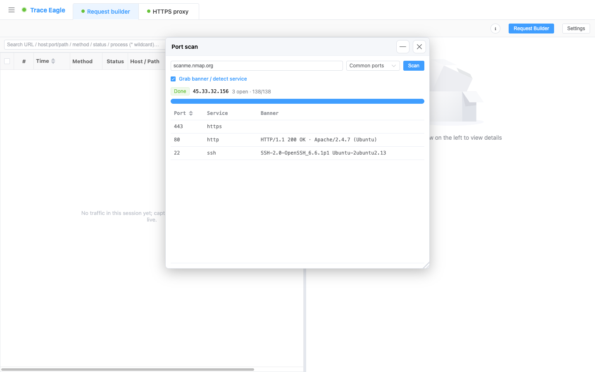
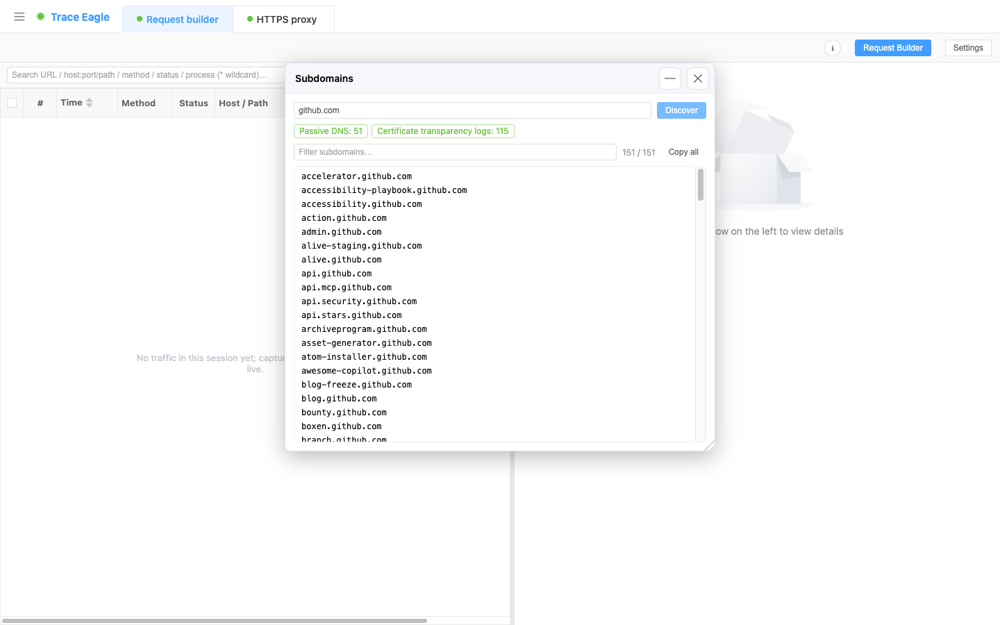

# 端口扫描与子域发现

> 拿到一台主机、或一个域名，想先摸清它对外暴露了什么？本篇教你用 TraceEagle 走两条路：**端口扫描**——主动探一台主机开了哪些端口、跑什么服务；**子域发现**——只读公开数据、不碰目标，就能挖出一个域名底下的子域。两者一被动铺面、一主动核点，配合起来盘点对外暴露面。

---

## 一、什么时候用

满足下面任一条就适合：

- 想摸清一台设备 / 服务器对外的**服务面**：开了哪些端口、大致跑什么、Banner 是什么。
- 拿到一个域名，想只凭公开数据就**盘点它对外暴露的子域**，不惊动目标。
- 做资产盘点、梳理对外暴露面：先被动挖子域铺开资产面，再对挑出的主机主动核端口。

两个功能**开箱即用**，不需要额外驱动或特权。

---

## 二、前置条件

- 已安装并启动 TraceEagle（首次启动同意系统权限即可）。
- **端口扫描**：知道要探的**主机名或 IP**。
- **子域发现**：知道要盘点的**域名**（如 `example.com`）。
- 子域发现全程只查询公开数据集，**不向目标发送任何请求**，无需与目标建立任何连接。

---

## 三、场景 A：端口扫描——探一台主机开了哪些端口、跑什么服务

1. 打开**端口扫描**，在目标框里填一个**主机名或 IP**。
2. 选**扫描范围**，三选一：
   - **常用端口**（默认）：一批精选的高频端口，最快出结果。
   - **全部端口（1–65535）**：最全，耗时也最长。
   - **自定义**：按需填，如 `80,443,8000-8100`。
3. 决定是否**抓取 Banner**：
   - **开启**（推荐）：连上开放端口取服务欢迎信息，据此校正服务识别。
   - **关闭**：仍按端口给出服务名，只是不再抓欢迎信息、也不据此校正。
4. 点**开始**。扫描过程实时显示进度与「已发现 N 个开放」，不用干等。

**怎么读结果**：每个开放端口给三列——

- **端口号**：探到开放的 TCP 端口。
- **服务名**：先按端口猜，再结合抓到的 Banner 修正。**把 SSH、redis、mysql 之类跑在非标准端口上，也能认出来。**
- **Banner**：抓到的服务欢迎信息；HTTP 端口则给出状态行与 `Server` 头。

开放端口列表可**按端口号排序**，一列看下来对外服务面一目了然。

---

## 四、场景 B：子域发现——被动摸清一个域名的子域

1. 打开**子域发现**，在框里填一个**域名**（如 `example.com`）。
2. 点**开始**。工具会并行查询多个公开情报源，边查边把子域列出来。
3. 想快速定位，直接在结果里**实时过滤**；要整份带走，点**一键复制全部**。

**怎么读结果**：来源分两类展示，各带**命中计数**——

- **证书透明度日志**：从公开的 CT 日志里挖出用过的子域。
- **被动 DNS**：从公开的被动 DNS 数据集里聚合子域。

结果自动**去重、排序**后列出。某个来源临时不可用或被限流也不会拖垮整体，其余来源照常出结果、各自标注命中数——所以看到某一类命中数为 0 不代表出错，换个角度已经把能挖的都挖出来了。

---

## 五、主动 vs 被动：两者怎么配合

|  | 端口扫描 | 子域发现 |
| --- | --- | --- |
| **对象** | 一台主机 / IP | 一个域名 |
| **方式** | **主动**探测目标端口 | **被动**查公开情报 |
| **是否与目标交互** | 是（直接连它的端口） | **否**（只读公开数据） |
| **拿到什么** | 开放端口 + 服务 + Banner | 对外暴露的子域清单 |

推荐顺序：先用**子域发现**只读公开数据铺开一个域名的资产面，再对挑出的主机用**端口扫描**核实开了哪些服务——被动铺面、主动核点，一套下来对外暴露面就清楚了。

---

## 六、技巧与排错

| 现象 | 多半是 | 怎么办 |
| --- | --- | --- |
| 扫描很慢、迟迟不完 | 选了「全部端口（1–65535）」 | 资产梳理先用「常用端口」快速铺开；确有需要再对单台主机跑全端口 |
| 开放端口的服务名像是猜错的 | 关掉了 Banner 抓取，只靠端口号猜 | 开启**抓取 Banner**，用真实欢迎信息校正——非标准端口上的服务也能认出来 |
| 某类情报源命中数为 0 | 该来源临时不可用或被限流 | 属正常，其余来源照常出结果；换个时间再跑那一类通常会恢复 |
| 子域列表太长、找不到想要的 | 结果条目多 | 用**实时过滤**按关键字收窄；或**一键复制全部**导出后再处理 |
| 想核实某个子域到底开了什么 | 子域只是清单，不含端口信息 | 把该子域 / 其 IP 填进**端口扫描**，主动核实开放端口与服务 |

---

## 下一步

- 挑出目标主机后，想看它的画像、归属、地理位置等：见 [主机详细信息](12-主机详细信息.md)。
- 想直接对某个服务发请求、验证接口：见 [请求构造与重放](17-请求构造与重放.md)。
- 摸清端口后想抓它的流量看明文：从 [代理抓包](02-代理抓包.md) 或 [网卡抓包](03-网卡抓包.md) 入手。
- 想确认某条链路通不通、延迟如何：见 [网络诊断](19-网络诊断.md)、[连接表](20-连接表.md)。
