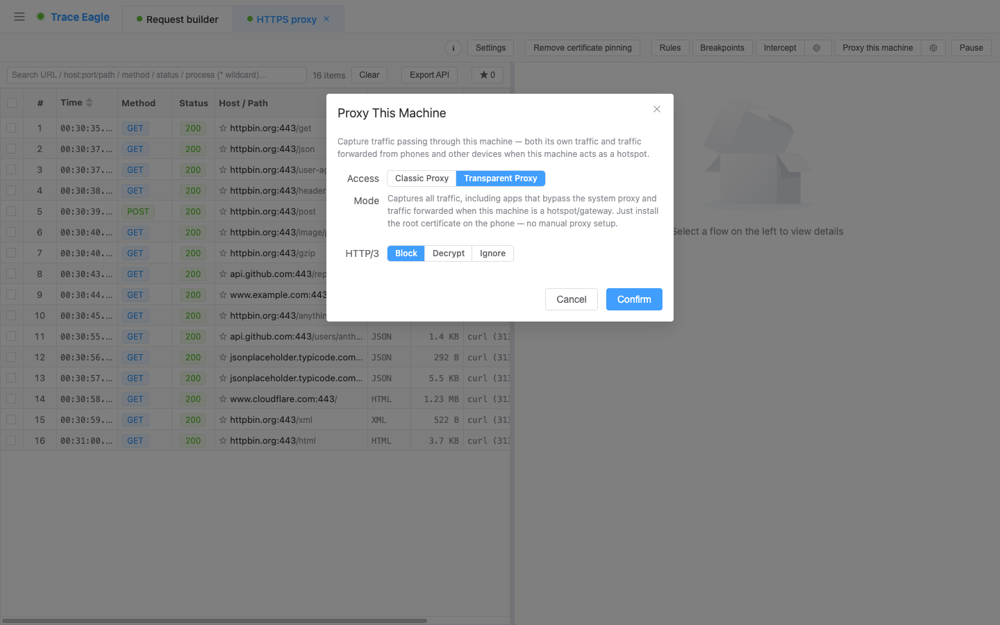
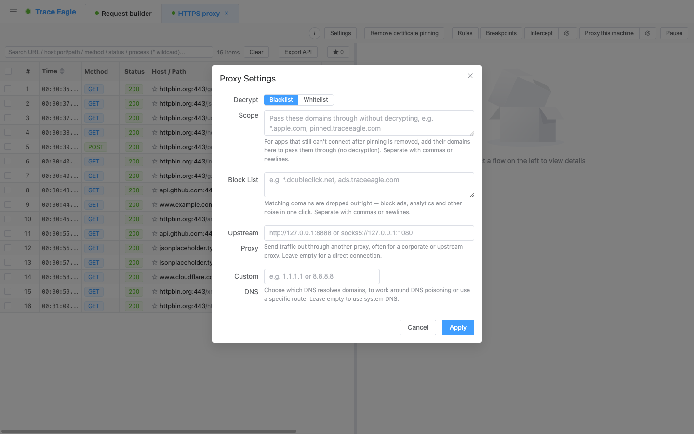

# 代理抓包

> TraceEagle 的代理抓包模块，让你把电脑、手机和局域网里其它设备的网络请求**完整、清晰、可解密**地呈现在眼前——不只是看，还能改、能拦、能重放、能对比、能溯源。
>
> 它和「又一个代理抓包工具」的根本区别在于：普通代理工具只有「设代理 + 中间人解密」这**一条路**，一旦碰上不认代理的程序、做了证书绑定的应用、Java / Python 等程序、私有二进制协议、或对流量特征敏感的应用，就基本束手无策。TraceEagle 把这些盲区逐个补齐——**不认代理也能抓、绑了证书也能解、私有格式也能还原、藏在系统噪音里也能定位到是谁发的、对流量特征敏感的应用也能保持原样、不干扰其正常运行地高保真观测。**

---

## 一、与普通代理抓包工具有什么不同

同样是代理抓包，差别不在「能不能看到请求」，而在**碰到硬骨头时还能不能继续工作、能不能看得更深**。

| 场景 | 普通代理抓包工具 | TraceEagle |
| --- | --- | --- |
| **程序不认系统代理**（很多客户端、后台服务、直连流量） | 抓不到，直接漏掉 | **无感代理**：无需任何应用配置，不认代理的程序、直连流量、本机做热点/网关转发的流量照样抓，还能按进程精确圈定 |
| **应用做了证书绑定（Pinning）** | 报错 / 连不上 / 只能放弃 | 一键**关闭目标应用的证书校验**，让它信任抓包证书继续解密；不想碰的站点精确透传 |
| **Java、Python 等程序** | 装了系统证书也白装，解不了 | **证书全覆盖**：这些普通代理解不了的程序，同样能解密 |
| **HTTP/3（QUIC）流量** | 支持弱、多数看不了 | 可**降级抓取**、**原样透传（保真）**或**真正解密**三档按需选择 |
| **私有 / 二进制协议、压缩与加密信封** | 一堆乱码，看不懂 | 自动解压、自动识别多种格式、可用分帧规则或 JS 脚本自定义解码 |
| **一堆进程混在一起，不知道流量是谁发的** | 只有 IP / 域名，靠猜 | 每条流量**标注来源应用 / 进程**；点开主机还能查完整档案 |
| **想认出对端是谁、客户端是什么** | 没有 | 点击主机看**归属/证书/地理档案**，查看每条连接的**客户端指纹（JA3/JA4）** |
| **对流量特征敏感的应用** | 中间人代理会改变网络请求特征，观测到的已非真实流量，还可能干扰目标 | **多档高保真模式**：保持流量原样、不改变网络请求特征，既不干扰目标应用，也确保你分析的是真实链路 |
| **接入方式 / 并行工作** | 基本只有代理一种、单会话 | 代理 + 网卡直抓 + 无感捕获 + 移动直连，**多会话并行、多端口互不干扰** |

> 一句话：**普通工具是「代理抓包」，TraceEagle 是「无论用什么姿势都能把流量抓下来、解开、看明白、还知道是谁发给谁」。**

---

## 二、灵活的接入方式（两种本机接入）

流量怎么进入抓包，取决于场景。在会话工具栏的 **「代理本机」→ 齿轮「接入设置」** 里可选两种接入模式：

- **传统代理（走系统代理，经典抓包）**：一键接入，浏览器、命令行、大多数应用自动走代理；停止后自动还原，**保证正常上网**，异常退出也有恢复兜底。局限：**App 若不走系统代理就抓不到**。
- **无感代理（全流量）— *普通工具的盲区***：无需任何应用配置，本机**全部流量（含直连、本机做热点/网关转发的流量）**都能抓；不走系统代理的 App 照样抓；可**按应用/进程精确圈定**只抓某几个程序；移动端装上根证书即可、无需手动设代理。

> **局域网设备抓包**：把手机/平板/其它电脑的代理指向本机即可抓取，配套证书一键安装引导（iOS/macOS 描述文件、扫码安装）。
>
> **可挂上游代理**：抓包会话本身还能再串一层上游代理（把本机抓包接到公司代理、跳板等二级代理上），链路透明、不影响解密。

---

## 三、HTTP/3（QUIC）三档处理

越来越多应用用上 HTTP/3，普通工具常在此断档。在「接入设置」里可选：

- **禁止（降级抓取）**：尝试把 HTTP/3 降级为 HTTP/2 以便抓取（少数 App 不支持）。
- **忽视（保真透传）**：原样转发、不解密，**高保真、不干扰程序的数据请求**。
- **解密（真 H3 MITM）**：真正抓取并解密，像普通 HTTPS 一样看明文。

> 传统代理支持「禁止 / 忽视」；**「解密」需在无感代理模式下使用**。

---

## 四、解密能力：不止「装个证书」

普通工具的解密就是「装一张系统证书 + 代理中间人」，稍有设防就失效。TraceEagle 是一套组合拳：

- **HTTPS 一键解密**：内置证书体系，装一次持续解密。
- **证书全覆盖安装**：系统证书一键全覆盖。普通代理即便装了系统证书也解不了的 Java、Python 等程序，这里同样能解密。
- **解除证书绑定（去 Pin）**：对做了 Pinning、平时直接报错拒连的应用，**一键解除其证书校验**继续解密。
- **白名单 / 放行名单 / 阻断名单**：白名单只解密指定域名、其余直接放行；放行名单对强校验站点原样透传不解密、避免报错；阻断名单对不想放行的域名直接拦掉。

---

## 五、多会话 / 多代理并行

- 多个抓包会话同时开，每个是独立页签，可单独启动/关闭/切换。
- 各会话**完全隔离**：独立的流量列表、详情、选中状态与配置；多个代理会话可**各自监听不同端口**同时工作。
- 代理、网卡直抓、无感捕获、移动直连可**同时开、按场景组合**，互不影响。

---

## 六、全协议支持

| 协议 | 支持能力 |
| --- | --- |
| **HTTP / HTTPS** | 完整请求-响应解析，明文查看 |
| **HTTP/2** | 原生解析，与 HTTP/1.1 一致的查看体验 |
| **HTTP/3（QUIC）** | 降级抓取 / 保真透传 / 真解密 三档可选（见上） |
| **WebSocket** | 逐帧展示收发消息（文本/二进制/ping/pong，标注方向） |
| **Server-Sent Events (SSE)** | 事件流逐事件展示 |
| **gRPC / protobuf** | 无需 .proto 即可解出字段结构 |
| **裸 TCP / UDP** | 非 HTTP 的自定义协议也能抓取原始数据 |
| **SOCKS5** | 共用同一端口接入，CONNECT 与 **UDP ASSOCIATE** 均支持，SOCKS 流量同样能解密 / 透传 |

---

## 七、高保真观测：不干扰目标、不改变流量特征

普通中间人代理会改变网络请求的特征——结果是你观测到的已经不是应用的真实流量，还可能影响目标应用的正常行为。对**流量特征敏感的应用**（如依赖网络请求数据指纹做一致性校验的服务），这既干扰了目标，也让分析失真。

TraceEagle 提供多档保真，尽量让抓包过程「透明」、贴近真实链路：**保真观测**（以最贴近真实客户端的方式观测，最小化对流量特征的改变）、**指纹重建**（在需要改写流量时仍保持一致的客户端指纹）、**固定客户端画像**（将流量特征还原为标准客户端，桌面 Chrome / Firefox / Safari、移动端 Safari，也可用随机画像）。配合「H3 忽视（保真透传）」，即使面对流量特征敏感的应用，也能在**不干扰其正常运行**的前提下如实抓取与分析。

---

## 八、进程归属与精准过滤

- **谁发的一目了然**：每条流量标注来源应用/进程，混杂环境快速定位目标——只看 IP/域名的普通工具给不了。
- **只抓你关心的**：结合无感代理按应用/进程精确圈定抓取范围，屏蔽噪音。

---

## 九、更强大的配套能力（各自独立成篇）

抓到之后的「看懂、溯源、改写、重放、压测」，每一块都很深，分篇详述：

| 能力 | 一句话 | 详见 |
| --- | --- | --- |
| **数据查看与解码** | 5 种查看方式 + 自动解压/识别/美化 + 媒体内联预览 + 私有协议分帧/脚本解码 | [数据查看与解码](05-数据查看与解码.md) |
| **主机详细信息** | 点击任意主机看归属(ASN/组织/注册)+ 地理地图 + DNS + TLS 证书体检 + Web 技术栈 | [主机详细信息](04-主机详细信息.md) |
| **规则改写与断点拦截** | 简单规则点选即可改请求、无需写脚本 + 断点逐条手动编辑 + 脚本/插件兜底复杂场景 | [规则改写与断点拦截](03-规则改写与断点拦截.md) |
| **请求构造与重放** | 一键重发/编辑重放 + 请求构造器 + 动态值签名 + 集合/环境 + 代码生成 | [请求构造与重放](02-请求构造与重放.md) |
| **请求对比（Diff）** | 两条请求/响应并排逐行比对，跨会话、跨来源，一眼看出差在哪 | [请求对比](07-请求对比.md) |
| **会话重放与压力测试** | 成批按序重放一串请求；对单条右键「压测此请求」，实时出吞吐与延迟分位 | [会话重放与压力测试](06-会话重放与压力测试.md) |

此外还有一个轻量但好用的能力：

- **连接指纹（JA3 / JA4）**：对任意 HTTPS 连接查看其客户端 TLS 指纹（JA3 含原始串、JA4，一键复制），不随 IP/UA 变化，用于识别客户端类型、辅助流量溯源与安全分析。

---

## 十、典型使用场景

- **接口联调**：Mock 造数据；把线上接口转发到本地/测试环境。
- **移动端抓包**：抓手机 App 的 HTTPS 请求，分析接口、排查问题。
- **啃硬骨头**：不认代理、证书绑定、Java / Python 等——用无感代理 + 去 Pin + 证书全覆盖拿下。
- **私有协议分析**：二进制/自定义协议用分帧规则或脚本解出结构。
- **故障排查**：看清请求发了什么、服务器返回了什么，定位参数/返回/跨域问题。
- **弱网测试 / 压力测试**：用规则模拟差网络；用压测评估接口容量。
- **安全审计 / 资产梳理**：审查对外通信、检查敏感信息泄露、核对证书、借主机档案摸清对端归属。
- **高保真分析**：对流量特征敏感的应用，保持流量原样、不干扰其行为地如实抓取与分析。

---

> 代理抓包是 TraceEagle 数据采集能力的一部分。除代理方式外，产品还支持网卡直抓、移动设备直连等多种抓包方式，可根据场景灵活组合使用。
