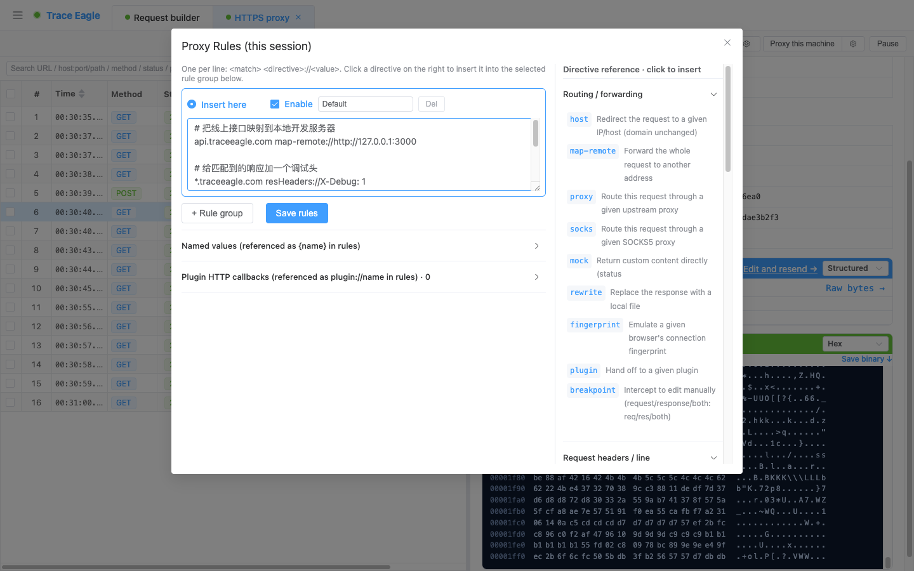

# 规则改写与断点拦截

> 抓包让你「看」，规则与断点让你「改」。TraceEagle 让你成为流量的主人：**改请求不用写代码**——用简单直接的规则点选即可自动改写成千上万条流量；也能用**断点**逐条暂停手动编辑；只有规则实在表达不了的复杂逻辑，才需要动用**脚本 / 插件**兜底。

---

## 一、规则改写（简单点选，自动改）

改请求最怕一上来就写脚本。这里**不用**：从速查表里**点选**一个动作，填上值就是一条规则——简单、直观、即改即生效。

规则一行一条，形如 `<匹配> <动作>://<值>`（比如 `*.example.com resHeaders://X-Debug: 1`）。空行与 `#` 注释忽略、每行单独校验、**保存即热生效**；规则可组织成命名分组、逐组开关。界面自带一份**可点击的速查表**，点一下就把对应示例插进来，照着改值即可，无需记语法。

### 灵活的匹配条件
- 精确域名：`traceeagle.com`（可带路径前缀 `traceeagle.com/path`）
- 通配子域：`*.traceeagle.com`（匹配主域 + 所有子域）
- 正则匹配整条 URL：`regex://…`
- 精确整条 URL：`$https://host/path`
- 端口：`:8080`
- 取反：任意匹配前加 `!`

### 支持的改写动作

**请求方向**
- **转发 / 重定向**：改拨测目标 IP（`host`）、映射到另一个完整 URL（`map-remote`，可指到本地开发服务器）、走上游 http/socks5 代理、将客户端网络请求特征还原为标准客户端（保真）。
- **Mock 假数据**：`mock://200` 或 `mock://200|<body>`，不请求服务器直接返回预设响应——前端等后端接口时的利器。
- **改请求行 / 头**：方法、User-Agent、Referer、Basic 鉴权、X-Forwarded-For、Content-Type / 字符集、Cookie、合并查询参数、URL 查找替换。
- **改请求体**：整体替换 / 查找替换 / 追加 / 前置 / 转储到本地文件。

**响应方向**
- **改状态 / 头**：改状态码、增删任意响应头、Set-Cookie、一键放开 CORS、强制附件下载、缓存控制（禁缓存或设 max-age）、禁用 Cookie/压缩/keep-alive、头值查找替换。
- **改响应体**：整体替换 / 查找替换 / 追加 / 前置 / JSON 浅合并。
- **按类型注入**：仅当 Content-Type 匹配时，向 HTML / JS / CSS 注入或替换脚本、样式、片段。

**网络与协议**
- **转储到文件**：除请求体 / 响应体外，**整条原始请求 / 响应**也可一键转储到本地文件，留存或离线分析。
- **弱网模拟**：请求 / 响应延迟（毫秒）、带宽限速（含 2G / 3G / 4G 预设）。
- **WebSocket 帧改写**：按方向（双向 / 客户端→服务器 / 服务器→客户端）做 `old=>new` 替换。
- **裸 TCP / UDP 改写**：对非 HTTP 字节流 / SOCKS5 UDP 数据报按方向替换。

### 规则里的动态值
规则值中可用 `${url} ${host} ${port} ${method} ${status} ${now} ${random} ${randomUUID} ${req.headers.X} ${res.headers.X}` 等动态变量，以及自定义的命名值 `{name}`（常用值定义一次、到处引用）。命名值 `{name}` 主要用于请求 / 响应改写；WebSocket 帧改写的替换值支持 `${...}`。

---

## 二、断点拦截（手动改）

对需要逐条精细控制的流量，用断点在**请求发出前**或**响应返回前**暂停并弹出编辑框。

### 两种触发方式
- **规则触发**：用 `breakpoint://req|res|both` 规则精确标记要拦哪些流量。
- **全局拦截开关**：整会话开启拦截，可再用**拦截过滤规则**收窄范围（按域名 / 方法 / 阶段过滤）；不加规则则拦截全部。

### 拦下来能改什么
- **请求阶段**：方法、URL（主机随 URL 变）、请求头、请求体。
- **响应阶段**：状态码、响应头、响应体。
- **直接丢弃**：Abort 丢掉这条请求 / 响应（客户端收到网关错误）。
- 多条命中的流量会**排队等你处理**：可逐条放行（Resume）、丢弃（Abort），或一键全部放行。**长时间未处理会自动原样放行**，流量不会被无限卡住。

---

## 三、脚本与插件（高级自动化）

规则表达不了的逻辑，交给脚本或插件：

- **JavaScript 脚本**：定义 `onRequest(req)` / `onResponse(resp)`，直接改字段即可生效。内置日志、同步外呼其它服务、跨请求暂存数据（做计数器 / 缓存令牌）、Base64 编解码等常用辅助能力。
- **HTTP 外呼插件**：用 `plugin://name` 规则把请求 / 响应交给你自己的插件服务处理（以 HTTP 方式调用），插件返回改写后的内容（或直接 Mock）。**语言无关**，适合团队用任意语言实现自定义处理。

---

## 四、处理顺序

一条流量依次经过：请求规则 → 请求脚本 → 请求插件 → 请求断点 → 转发 / Mock → 响应规则 → 响应脚本 → 响应插件 → 响应断点。规律很简单：**先自动规则、再脚本、再插件，最后才轮到断点手动介入**——各司其职、互不打架。

---

> 返回 [代理抓包](01-代理抓包.md) · 相关：[请求构造与重放](02-请求构造与重放.md)
