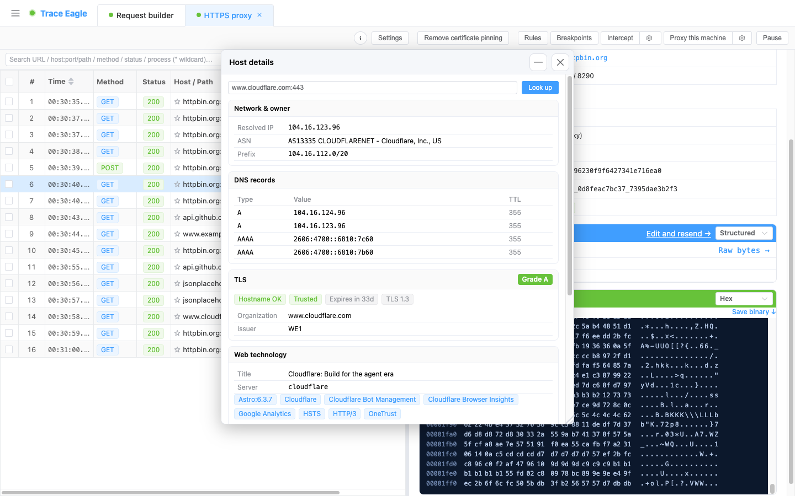
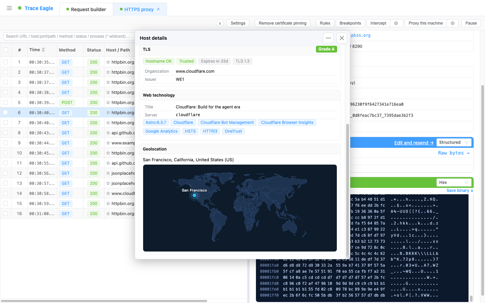

# 主机详细信息

> 普通抓包工具里，一条流量只有一个 IP 和一个域名。在 TraceEagle 里，**点一下这个主机**，就能看到它的完整档案：它属于谁、在哪里、证书健不健康、跑的什么技术。无论手里是 IP 还是域名，点一下都能查。排障、安全审计、资产梳理都用得上。

---

## 一、随处可点开

只要界面上出现抓到的**主机 / IP / SNI**，点击它即可打开主机档案（自动带入并开始查询）：

- HTTP 流量详情里的目标 IP、主机名
- TCP / TLS 流量详情里的目标 IP、SNI
- 流量列表、数据包视图的右键菜单「查看主机详细信息」
- 实时连接面板

点击后即可看到该主机的完整档案。

---

## 二、档案里有什么

### 归属信息（谁的 IP）
- 解析出的 IP、反向 DNS（PTR）
- **ASN**：编号 + 名称 + 宣告的路由前缀（CIDR）
- 所属**组织**、注册局与国家
- 网段（CIDR + 分配类型）
- **滥用举报联系人**

### 地理位置（在哪里）
- 城市 / 地区 / 国家（含 ISO 代码）
- **世界地图**上标注具体位置，一目了然

### DNS 记录
- A / AAAA / MX 记录，展示类型 / 值 / TTL

### TLS 证书体检（安不安全）
- **A / B / C / F 安全评级**（醒目色标）
- 主机名是否匹配、证书链是否可信、到期情况（是否过期 / 剩余天数）
- TLS 版本、证书颁发者与主体（组织）
- 配合 TLS 审计工具还能看：**完整证书链**（主体 / 颁发者 / 有效期 / 剩余天数 / DNS 名 / 是否 CA / 密钥类型 / 签名算法 / 是否自签）、**支持的协议列表**、**加密套件及其强度**（弱套件 / 前向保密标记）、本次握手**实际协商用的套件**、以及**证书透明度（CT）日志**——把一张证书背后覆盖的**全部主机名一次列全并给出总数**，连没在流量里出现过的关联子域也一并挖出

### Web 技术栈（跑的什么）
- 页面标题、Server 头
- 识别出的服务端 / 框架 / CMS / 库（以标签形式展示）

---

## 三、能帮你做什么

- **排障**：一眼看清「这条流量到底连的是谁、走哪个机房 / 运营商」。
- **安全审计**：核对证书是否可信、是否将过期、加密套件是否够强、有没有降级风险。
- **资产梳理 / 溯源**：借 ASN、组织、注册信息摸清对端归属；再顺着 CT 日志，把一张证书覆盖的全部主机名、关联子域一次挖全——这是普通抓包工具完全没有的溯源能力。
- **投诉举报**：直接拿到滥用举报联系人。

> **一条流量 vs 一整份档案**：普通抓包工具里，一条流量止步于**一个 IP + 一个域名**；这里点一下，归属、地理、证书体检、技术栈**一次看全**。

---

> 返回 [代理抓包](01-代理抓包.md)
