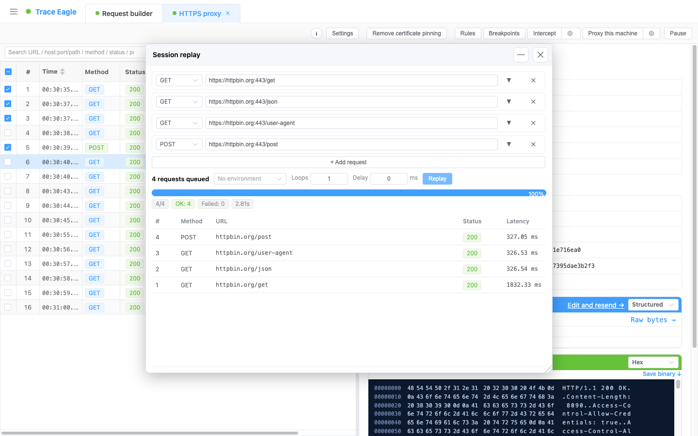
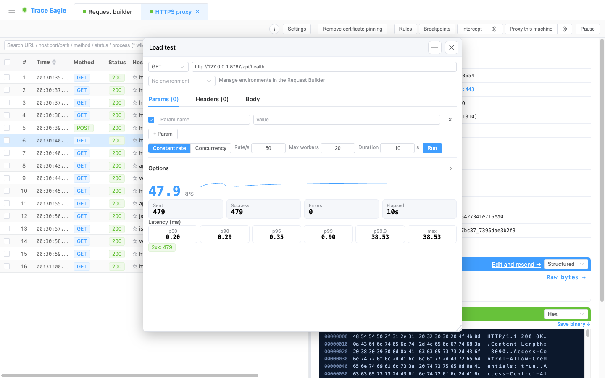

# 会话重放与压力测试

> 抓到的请求，能原样再跑一遍——两种玩法各司其职：**会话重放**把一串请求按原顺序**成批复现**（复现流程、回归验证、换环境重放）；**压力测试**对一条请求**高频施压**，测它扛不扛得住。两者都能从抓包记录**右键直达**，连带**签名 / 时间戳**的私有接口也照跑不误。

---

## 一、三种「再发一遍」，各管一摊

同样是把抓到的请求再发出去，按目的分工：

| 能力 | 定位 |
| --- | --- |
| [请求构造与重放](02-请求构造与重放.md) | **单条**请求的编辑与重发 |
| **会话重放**（本篇上半） | **多条按序**成批重放，关注每条的状态与延迟 |
| **压力测试**（本篇下半） | 对一条请求**高频施压**，测吞吐与延迟分位 |

---

## 二、会话重放：成批复现一串请求

把抓到的**一串**请求，按原来的顺序**成批**再跑一遍——忠实还原请求序列，可整串循环 N 次。

**怎么来**

- **从抓包播种**：在抓包列表右键「重放此请求」，或勾选多条后「重放选中的请求」。
- **手动添加**：面板里「+ 新增请求」，每条都能就地编辑方法 / URL / 参数 / 头 / Body。

**可配置**

- **循环次数**：整串序列重复跑 N 次。
- **请求间隔**：每条之间暂停一段时间。
- **环境切换**：选一个环境，一键把整串请求切到另一环境重放。

**结果**：逐条列出方法、URL、状态码、延迟，并给出总进度、成功 / 失败计数与总耗时。

**什么时候用**

- 复现一个**多步流程**或**时序相关**的问题。
- **批量回归**验证一组接口。
- 把线上抓到的一段请求，切到**测试环境**原样重放。

---

## 三、压力测试：把一条请求打到极限

抓到一个接口，想知道它扛不扛得住？在任意抓到的请求上右键「压测此请求」直接开压，实时出吞吐与延迟分位。

### 两种入口

- **从抓包记录直接压**：右键「压测此请求」——方法 / 地址 / 头 / 体自动带入并**立即开始**，缺失的协议自动补全。
- **手动配置**：从工具箱打开「压测」，自己填目标与参数。浮窗形式，可**同时开多个窗口跑多个独立压测**，互不干扰。

> 和一般压测工具不同：这里**抓到的请求右键即压、无需重填参数**——省去「先在别处抓、再手动搬进压测工具」的来回。

### 两种模式

- **恒定速率（QPS）**：按设定的每秒请求数均匀发压，采用**更严谨的延迟统计口径**，高负载下 **p99 等尾延迟依然真实、不虚低**——适合评估「这个接口在 X QPS 下的真实延迟」。这套严谨口径主要作用于本模式。
- **并发**：固定并发数背靠背连发，用来**打最大吞吐**——适合测「极限能扛多少」。

### 可配置参数

- **请求**：方法（GET / POST / PUT / PATCH / DELETE / HEAD）、URL（可省协议，自动补 https）、Query 参数表、请求头表、请求体（JSON / 表单 / 原始）。
- **压力**：速率（1–100000 req/s）、并发 / 连接数（1–2000）、持续时长（1–3600 秒，按时长而非固定总数）。
- **高级**：跟随重定向、跳过 TLS 校验。
- **连接**：自动复用连接（keep-alive）；对 HTTPS 目标自动尝试 HTTP/2。

### 实时结果

- **吞吐**：大号实时 RPS 数字 + 实时吞吐折线图。
- **计数**：已发送 / 成功 / 错误 / 已用时。
- **延迟分位**（毫秒）：p50 / p90 / p95 / p99 / p99.9 / 最大。
- **状态码分布**：按 2xx / 3xx / 4xx / 5xx / 错误 分类彩色标签。

随时可停；关闭窗口自动停止在途压测。

---

## 四、一样强大的请求编辑能力

无论会话重放还是压测，请求的编辑都和 [请求构造器（Composer）](02-请求构造与重放.md) 一脉相承：支持**环境变量**与**动态值**（UUID、时间戳、随机数、Base64、MD5 / SHA、HMAC 签名、URL 编码等）。所以那些**需要签名 / 时间戳**才放行的私有接口，一样能成批重放、能压测——不用手动算签名。

---

> 返回 [代理抓包](01-代理抓包.md) · 相关：[请求构造与重放](02-请求构造与重放.md)
