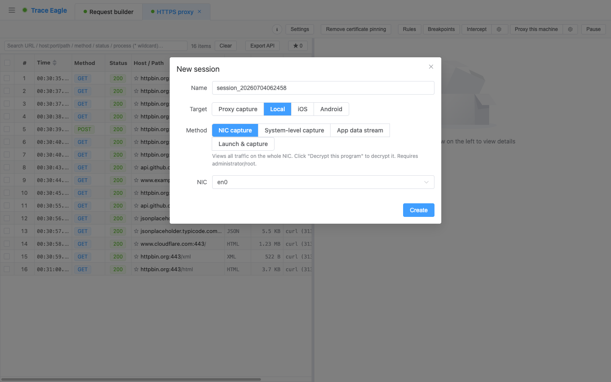
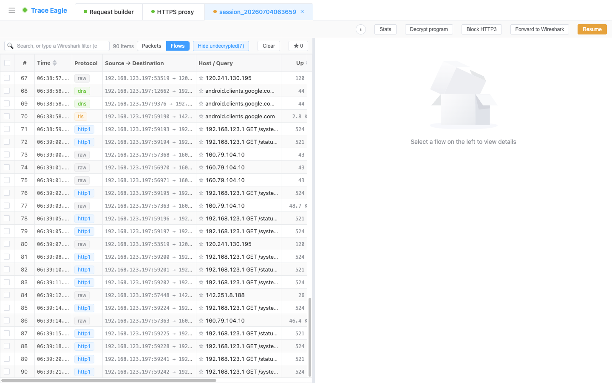

# 本机网卡抓包

> 代理抓包看的是「走代理的那部分流量」；网卡抓包看的是**这台机器网卡上流过的一切**——DNS、QUIC、游戏、IoT、各种私有协议，凡是经过网卡的都在眼前。而且它比传统抓包工具多走了一大步：抓到的 HTTPS **不再是一堆密文，而是能解密、能看清是谁发的、能拆开看懂**。

---

## 一、和代理抓包有什么不同

两种互补的抓法，各有各的场景：

| | 代理抓包 | 本机网卡抓包 |
| --- | --- | --- |
| **怎么接入** | 让流量走代理 + 信任证书 | 直接抓网卡上的原始数据包，**不改任何设置、不装证书** |
| **能看到什么** | 走了代理的流量，主要是 HTTP(S) | 网卡上的**全部**流量：DNS、QUIC、ICMP、ARP、任意 TCP / UDP…… |
| **默认是否明文** | 默认出明文 | 默认密文，需要时一键「解密此程序」（见下） |
| **最适合** | 调 HTTP 接口、改写 / 重放 | 看非 HTTP 流量、看某程序的全部网络行为、不想动系统设置 |

> 一句话：**代理抓包「精」，网卡抓包「全」。** 想看某个 App 到底还偷偷连了哪些地址、用了哪些协议，网卡抓包一览无余。

---

## 二、和传统网卡抓包工具有什么不同

传统网卡抓包工具能抓到包，但抓到的 HTTPS **是一堆密文**、也**不知道是哪个程序发的**。本机网卡抓包在「抓得到」之上，把「看得懂、查得清」补齐了：

- **能解密**：一键把某个程序的 HTTPS 从密文还原成明文（见第四节），而不是只能看密文。
- **知道是谁发的**：每条流量标注**来源进程**，混杂环境里一眼定位。
- **能查对端来历**：点一下远端 IP，直接看它的[主机档案](04-主机详细信息.md)（归属 / 地理 / 证书）。
- **能拆开看懂**：抓到的数据自动解压、识别格式、结构化展示，私有协议还能自定义解码（见第六节）。
- **还能反哺 Wireshark**：需要专业逐包分析时，一键把流量实时转发给 Wireshark、**打开即是明文**，甚至转到另一台机器。

---

## 三、怎么抓

1. **选一块网卡**：自动列出本机所有网卡，默认帮你挑好当前活动的那块。
2. **开抓前可设过滤条件**：想只抓关心的流量，填一条抓包过滤条件即可，并内置常用预设（TLS / HTTP / QUIC / DNS / TCP / UDP / ICMP / ARP / SSH 等），点一下就用。
   > 抓包过滤在**开始前**设定、开始后不可改——它决定网卡这一层「抓哪些」。想在已抓的数据里再筛，用逐包视图的「显示过滤」（见第六节）。

---

## 四、看明文：三步把密文变明文

网卡抓到的流量默认是**密文**（原样抓取、没有做中间人）。看明文分三档，层层兜底：

1. **自动解密**：浏览器、Electron 应用等常见程序**通常抓到即明文**，无需额外操作。
2. **手动「解密此程序」**：不能自动解密的程序，点「解密此程序」、选中它，即可解出它的加密流量。支持对**多个程序**同时解密。
3. **两个加强开关**：
   - **重启程序**：从头启动目标，连它**启动初期**的加密流量也一并解出。
   - **一键处理子进程**：有些程序由子进程收发流量，勾上会**连同子进程一起处理**，避免漏解。

> 常见程序抓到即是明文，其余程序手动点一下「解密此程序」也能解出——把密文变明文，通常就是一步的事。

---

## 五、两种视图：逐包看 与 连接看

- **逐包视图**：像专业抓包工具一样逐个数据包看。选中一帧，即可看到帧信息、原始字节，以及**逐层展开的协议分层树**。搜索框支持 **Wireshark 风格的显示过滤**（如 `tcp.port==443`、`tls.handshake`），**边输入边校验语法**，在已抓的全量数据里精确定位。

- **连接视图**：把散落的包**重组成一条条连接**，「**追踪此连接（Follow Stream）**」完整看整条连接从头到尾的收发；HTTP / DNS 等还能结构化查看。

- **右键联动**：对任意一帧右键，可**只看此连接 / 过滤此连接**（把视野收窄到这一条）、**标记该帧**、**复制源 / 目的地址**，或对远端 IP 直接**查主机档案 / ping / 端口扫描**——顺手接上后续排查。
- 两个视图**互相跳转**（从连接跳回原始包、或从某个包追踪整条连接）。
- **统计分析**：按协议分层、会话、端点三张表汇总，可只统计当前过滤结果，快速看清「谁在占流量、和谁在通信」。
- **随时暂停**：抓包途中可暂停，先看已抓的、理清了再继续，长会话不必来回开停。

---

## 六、抓到之后：看得懂、解得开

同一条数据能用**多种方式查看**、引擎还会**自动帮你解开**——这套能力对所有抓包方式通用，这里同样适用：

- **多种查看方式**：结构化、文本美化、十六进制、自动识别，收发两侧独立切换。详见 [数据查看与解码](05-数据查看与解码.md)。
- **自动识别多种编码**：解密后的 HTTP 内容会自动解压 gzip / brotli / deflate / zstd（含多层叠加），自动识别并美化 JSON、XML、表单、protobuf / gRPC、plist，图片 / 音视频内联预览。详见 [数据查看与解码](05-数据查看与解码.md)。
- **自定义编解码器**：遇到私有 / 自研协议，写一小段脚本自己教它怎么读，把它拆帧、剥头、解压成可读结构。详见 [自定义协议解码](20-自定义协议解码.md)。

---

## 七、应对 HTTP/3：让 QUIC 流量也能抓、能解

越来越多 App 改用 HTTP/3（QUIC）通信，而 QUIC 在网卡层历来难抓、难解——很多工具到这里就断了档。本机网卡抓包两条路都行：既能让目标 App 从 HTTP/3 平滑回退到普通连接、于是**重新变得可抓、可解密**（停止会话即自动恢复，不影响 App 之后的正常使用），拿到密钥时也能**直接解开 QUIC / HTTP/3** 看明文。

> 这意味着：即便面对已经全面 HTTP/3 化的应用，你依然看得到它的明文往来，而不是对着一堆抓不动的 QUIC 干瞪眼。

---

## 八、无缝对接 Wireshark 做深度分析

需要 Wireshark 级别的专业逐包分析时，不必在两个工具之间反复导来导去：一键把本会话的流量**实时**送进 Wireshark，而且**打开就是明文**、不需要任何额外配置。**解密密钥随流量实时增量注入**，所以晚到的密钥也补得上、不会丢帧。

它甚至能把流量送到**另一台机器**上的 Wireshark——本机负责抓取与解密、另一台专心分析，天然适合远程协作与联合排查。

- **也能导出成文件**：一键导出**内嵌解密密钥的 `.pcapng`**（用 Wireshark 打开即是明文）或标准 **HAR**，转交同事直接打开、无需再配任何东西。

> 于是你**两头的好处都占了**：本工具的「解密 + 进程归属 + 一键查主机档案」，加上 Wireshark 的深度逐包解析。

---

## 九、典型使用场景

- **看非 HTTP 流量**：DNS、QUIC、游戏、IoT、各种私有协议——代理抓不到的，网卡都能抓。
- **摸清一个程序的全部网络行为**：它到底连了哪些地址、用了哪些协议、有没有「悄悄」的连接。
- **不想改系统代理、不想装证书**：直接抓，零侵入。
- **啃私有协议**：抓到裸流后，用自定义解码器把它还原成可读结构。
- **交给 Wireshark 深挖**：需要专业逐包分析时，实时转发过去，**打开即是明文**、无需任何额外配置。

---

> 返回 [代理抓包](01-代理抓包.md) · 相关：[数据查看与解码](05-数据查看与解码.md) · [自定义协议解码](20-自定义协议解码.md) · [主机详细信息](04-主机详细信息.md)
