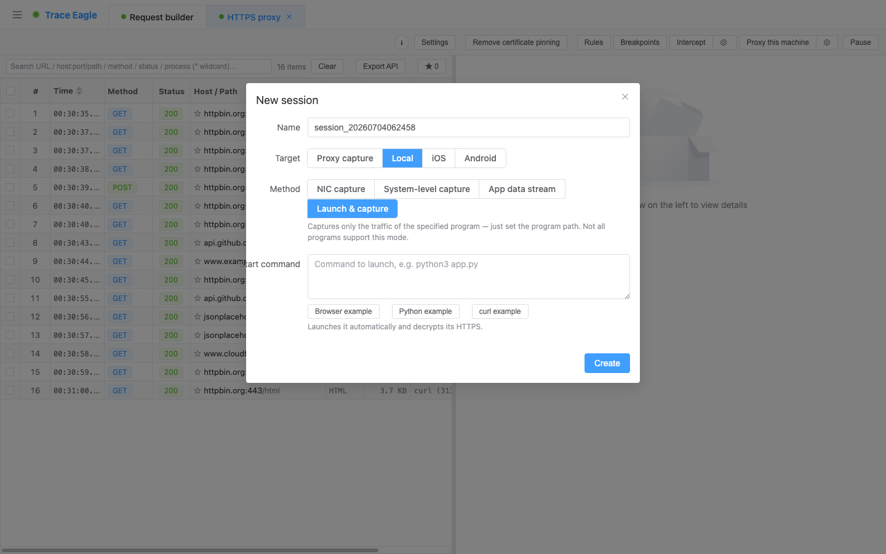
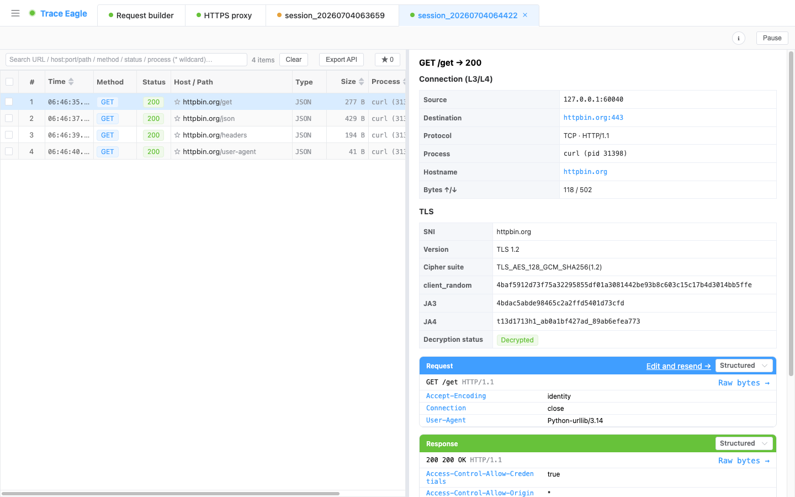

# 本机指定程序抓包

> 只想看某一个程序的流量，又不想「改全局代理、装证书、抓完再还原」那一套折腾？给它一条启动命令，工具替你把程序拉起来——**只抓它一个、启动即看明文**，对系统里其它软件零干扰。最轻、最干净的单程序抓法。

---

## 一、和代理抓包有什么不同

用代理抓某一个程序，往往要改系统代理、给它装证书、抓完还得还原，一不小心波及别的软件。指定程序抓包把这些全省了：

| | 代理抓单个程序（传统做法） | 本机指定程序抓包 |
| --- | --- | --- |
| **系统全局代理** | 要改，抓完要还原 | **不动** |
| **装证书** | 要装，程序还得信任它 | **不用** |
| **影响其它软件** | 可能（全局代理会波及） | **零干扰**（只作用于这一个程序） |
| **看明文** | 要程序认证书才行 | **启动即明文**（常见程序自动解密） |
| **抓完收尾** | 要还原代理 / 卸证书 | **停掉即可**，什么都不用还原 |

> 一句话：**代理抓包动的是「整台机器」，指定程序抓包只动「这一个程序」。** 想干净利落地看某个程序在发什么，这是最省心的一种。

---

## 二、它强在哪

- **只抓这一个程序，零侵入**：不改系统代理、不装证书、不碰网卡，只让**你启动的这个程序**被抓到。系统里其它软件完全不受影响，抓完也无需善后。
- **启动即明文，覆盖面广**：浏览器、Electron 类桌面应用、Node、Python、桌面 Java，以及使用通用加密库的命令行工具——**一条命令拉起来就直接看明文**，不用给程序配任何东西、也不用装证书。
- **子进程自动跟随**：程序内部再拉起的子进程，也会**一并被抓到**，不漏。
- **随手即用**：调一个脚本、验证一个接口，填条命令就开抓——比架代理、装证书快得多。

---

## 三、怎么用

在「启动命令」里填要运行的命令（比如 `python3 app.py`），工具会启动它、只抓它的流量。内置三个一键示例，点了自动填好、可再编辑：

- **浏览器示例**：拉起一个**独立、干净的浏览器窗口**（不影响你日常在用的浏览器），直接抓它；并已帮你把 HTTP/3（QUIC）回退成普通连接，好抓、能解。
- **Python 示例**：一条命令发个请求就能看到明文。
- **命令行示例**：命令行发起的 HTTPS 请求即抓。

> 抓其它程序时若它也走 HTTP/3，可开启会话级的「阻止 HTTP/3」让它回退成普通连接，同样变得好抓、能解。

---

## 四、看明文：哪些能、哪些换个方式

- **常见程序：启动即明文**。浏览器、Electron 应用、Node、Python、桌面 Java，以及用通用加密库的命令行工具，启动后**直接看到明文**，无需任何额外操作。

- **少数程序解不了密**（能抓到、但只有密文）：个别**使用特殊加密库**的程序，在这种方式下拿不到明文——最典型的是 **macOS 系统自带的 `curl`**（以及基于同一套系统加密库的工具）；部分**纯 Go 编写**的程序也是如此。
  > 命令行发 HTTPS 想看明文，用「Python 示例」最稳；或改用 OpenSSL 版的 `curl`。
- **完全不认代理设置的程序**：这种方式抓不到它的流量。

遇到上面这些「设防」或特殊的程序，换用 [本机应用层抓包](10-应用层抓包.md)——它**从程序内部直接取明文**，连证书绑定、自研加密、系统加密库这些都能拿下。

---

## 五、抓到之后：看得懂、解得开

抓到的数据走的是和其它抓包方式**同一套处理**，一样看得懂、解得开：

- **多种查看方式**：结构化、文本美化、十六进制、自动识别，收发两侧独立切换。详见 [数据查看与解码](05-数据查看与解码.md)。
- **自动解压与识别**：自动解压 gzip / brotli / deflate / zstd（含多层叠加），自动识别并美化 JSON、XML、表单、protobuf / gRPC 等。
- **自定义编解码器**：遇到私有 / 自研协议，写一小段脚本自己教它怎么读。详见 [自定义协议解码](20-自定义协议解码.md)。

---

## 六、本机四种抓法怎么选

| 你的情况 | 用哪种 |
| --- | --- |
| 能用命令启动的常规程序（浏览器 / 脚本 / CLI） | **本机指定程序抓包**（本篇，最省事） |
| 想看整机全部流量、非 HTTP 流量、某程序的全部网络行为 | [本机网卡抓包](08-网卡抓包.md) |
| 程序已在运行 / 证书绑定 / 不认代理 / 自研加密 / 系统加密库 | [本机应用层抓包](10-应用层抓包.md) |
| macOS 上的系统自带 App / 顽固应用 | [本机系统级抓包](11-系统级抓包.md) |

---

## 七、典型使用场景

- **调脚本 / 验接口**：写了个 Python / Node 脚本，想看它到底发了什么、收了什么——填条命令直接看明文。
- **只想盯一个程序**：不想动系统设置、也不想影响别的软件，只看这一个程序在和谁通信。
- **抓一个干净的浏览器会话**：用示例拉起独立浏览器窗口，不掺杂你日常浏览器里一堆插件和标签页的噪声。

---

> 返回 [代理抓包](01-代理抓包.md) · 相关：[本机应用层抓包](10-应用层抓包.md) · [数据查看与解码](05-数据查看与解码.md)
