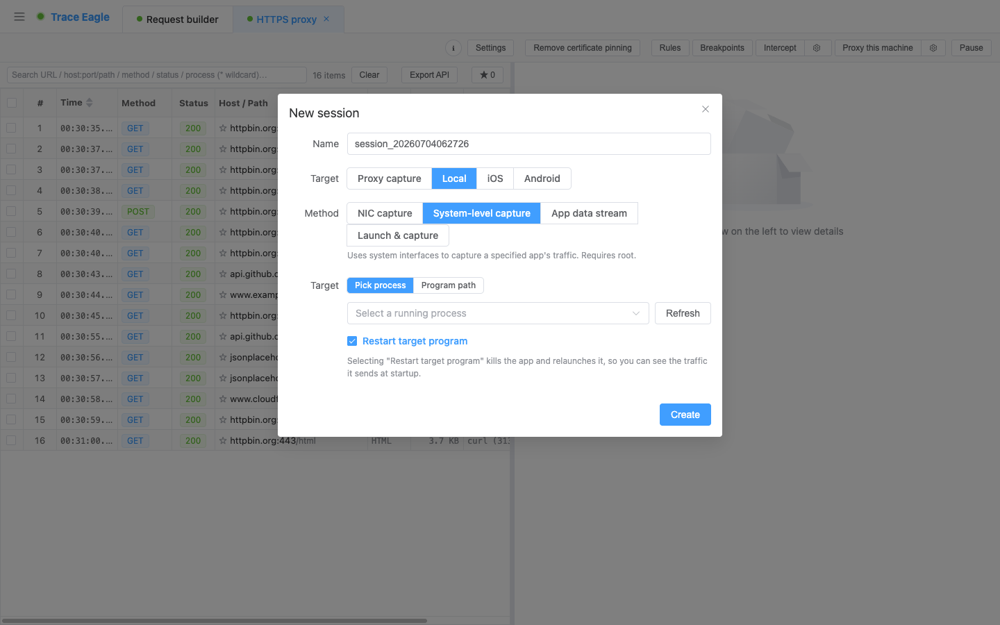
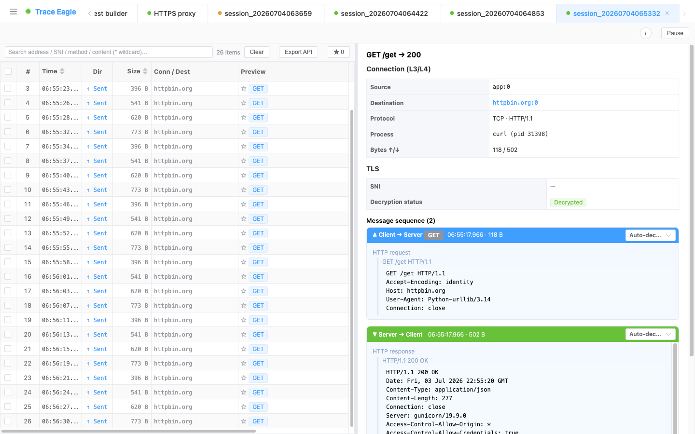

# 本机系统级抓包

> 有一类目标，连「从内部取明文」都做不到——macOS 上的系统自带 App、以及格外顽固、藏得很深的应用，会把一切外部介入挡在门外。系统级抓包**不进入程序、从系统底层观测**，连这些**别的工具连门都摸不到**的目标，也能读出明文。这是本机抓法的最后一张底牌。
>
> 本篇讲 **macOS**；Windows 上走系统网络栈的系统程序（.NET / PowerShell 等）有等价能力，见 [本机应用层抓包](10-应用层抓包.md)。

---

## 一、它能看到「别的工具够不着」的东西

想看 macOS 系统自带 App、系统服务、或那些顽固、藏得很深的应用在跟服务器说什么？平时你会处处碰壁：代理会被它们拒之门外（认不了证书、直接报错），想从程序内部取明文又会被系统防护挡在外头，网卡上抓到的则只是一堆密文。**系统级抓包是少数能读出它们明文往来的方式。**

本机抓法一层比一层能打，它站在最后：

| 目标 | 网卡 / 指定程序 | 应用层抓包 | 本机系统级抓包 |
| --- | --- | --- | --- |
| 普通程序 | ✅ | ✅ | ✅（多此一举） |
| 证书绑定 / 自研加密 | 🔒 密文 | ✅ 明文 | ✅ 明文 |
| 顽固 / 高度藏匿的应用 | 🔒 / ❌ | ❌ 拒绝介入 | ✅ **明文** |
| **系统自带 App / 系统服务** | 🔒 / ❌ | ❌ 拒绝介入 | ✅ **明文** |

> 前面几种都拿不下的目标，交给它。

---

## 二、它凭什么能啃下系统 App

- **不进入程序**：系统自带 App、以及顽固难缠的应用会**挡掉一切「进到程序内部」的介入**——[应用层抓包](10-应用层抓包.md) 那种方式对它们失效。系统级抓包**换个角度**：**不注入、不改动程序、不碰证书**，只在系统底层旁路读取，因此这层防护拦不住它。
- **不碰证书**：它不做中间人、不动证书，所以**证书绑定天然无效**，这类应用再严的证书校验也影响不到它。
- **够得着别人够不着的那层**：macOS 系统自带 App、App Store、各类系统服务，走的是系统更底层的网络通道——这恰恰是前面几种抓法的**共同盲区**。系统级抓包正好覆盖到这一层，把它们的明文尽收眼底。

---

## 三、能拿下哪些目标

- **系统自带 App 与系统服务**：App Store、系统组件、后台服务等 macOS 自家程序的网络往来。
- **顽固、藏得深的应用**：把流量藏得很深、拒绝一切外部介入的第三方程序。
- **普通程序**：当然也能，只是杀鸡用牛刀——常规程序用前面几种更省事。

---

## 四、怎么用

1. **选目标**：下拉选一个正在运行的程序，或填程序路径 / 名称。
2. 可选 **抓「启动那一刻」**：让它先关掉、再由工具拉起，把**启动初期**的流量也一并抓到（很多鉴权 / 握手就发生在这一瞬间）。
3. 开抓，查看该程序收发的明文。

---

## 五、抓到之后：看得懂、解得开

从底层观测到的明文，走的是和其它抓包方式**同一套处理**：

- **多种查看方式**：结构化、文本美化、十六进制、自动识别，收发两侧独立切换。详见 [数据查看与解码](05-数据查看与解码.md)。
- **自动解压与识别**：自动解压 gzip / brotli / deflate / zstd（含多层叠加），自动识别并美化 JSON、XML、protobuf / gRPC 等。

---

## 六、本机四种抓法怎么选

| 你的情况 | 用哪种 |
| --- | --- |
| macOS 上的系统自带 App、顽固应用（别的方式抓不到） | **本机系统级抓包**（本篇） |
| 程序已在运行 / 证书绑定 / 不认代理 / 自研加密 | [本机应用层抓包](10-应用层抓包.md) |
| 能用命令启动的常规程序（浏览器 / 脚本 / CLI） | [本机指定程序抓包](09-指定程序抓包.md) |
| 想看整机全部流量、非 HTTP 流量 | [本机网卡抓包](08-网卡抓包.md) |

---

> 返回 [代理抓包](01-代理抓包.md) · 相关：[本机应用层抓包](10-应用层抓包.md) · [数据查看与解码](05-数据查看与解码.md)
