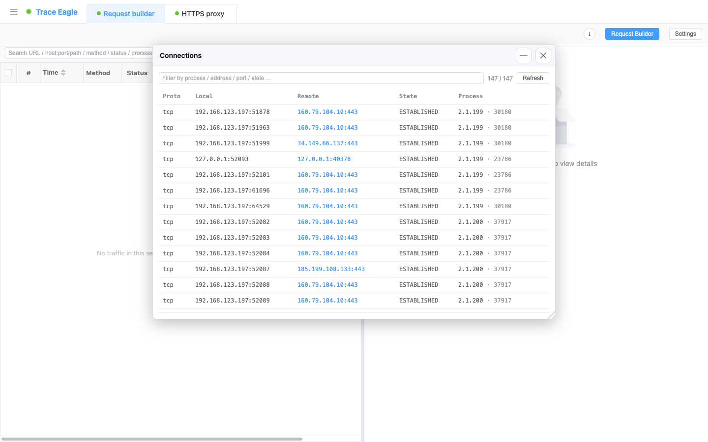

# 连接表

> 「哪个程序在偷偷联网？它连去了哪儿？」连接表列出本机当前**所有活动连接**，每条都标明是**哪个进程**在连，一眼看清这台机器的对外通信全貌。

---

## 一、它能看到什么

本机当前所有活动连接（**TCP / UDP、IPv4 / IPv6** 全覆盖），每条一行：

- **协议**、**本地地址 : 端口**、**远端地址 : 端口**、**连接状态**。
- **进程归属**：是哪个程序（**进程名 + PID**）在使用这条连接——这正是普通「看连接」给不出的一层。

---

## 二、好用的地方

- **进程归属，一眼到人**：不只看到「有条连接连去了某个地址」，还直接告诉你**是哪个程序**在连——排查「谁在联网」不用再另开工具去比对 PID。
- **同程序自动归拢**：同一程序的多条连接自动聚在一起，一眼看全某个进程的全部对外通道。
- **按需过滤**：按进程、协议、PID、地址、端口、状态实时筛选，从一大片连接里快速拎出关心的那几条（并显示「筛出 / 总数」）。
- **一键查对端来历**：点某条的**远端 IP**，直接跳到 [主机详细信息](04-主机详细信息.md)，查它的归属、地理位置、证书、技术栈档案。
- **刷新取最新**：点「刷新」取一份最新的连接快照。

## 三、和普通「看连接」工具的差异

| 场景 | 普通看连接工具 | 连接表 |
| --- | --- | --- |
| **一条连接连去了某个远端** | 只有地址，不知是谁发的 | 直接给出**进程名 + PID** |
| **拿到一个可疑远端 IP** | 得另开工具查它是谁 | 点一下就跳 [主机详细信息](04-主机详细信息.md)，归属 / 地理 / 证书 / 技术栈一次看全 |
| **一个程序开了多条连接** | 散落在长列表里 | 同程序自动归拢，一眼看全它的全部对外通道 |

> 一条闭环：发现可疑连接 → 认出是哪个程序 → 点远端 IP 直接看对端档案，全在一个窗口内查完。

---

## 三、什么时候用

- 排查「哪个程序在偷偷联网 / 连了哪个远端」。
- 查看某个进程当前的连接与占用端口。
- 把可疑的远端 IP 一键查情报、摸清对端来历。

---

> 返回 [代理抓包](01-代理抓包.md) · 相关：[主机详细信息](04-主机详细信息.md)
