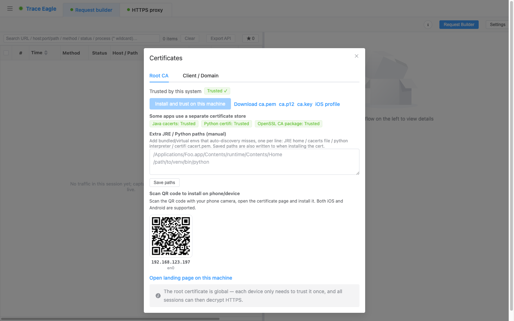

# 证书管理与安装

> 用代理抓 HTTPS，第一步是让设备和软件**信任本工具的根证书**——否则会 TLS 报错、解不了密。证书管理把这件事做到一键、全覆盖：本机、手机、以及那些「装了系统证书还是不认」的程序，统统能装。

---

## 一、本机一键安装

- 随时查看**本机是否已信任**本工具的根证书。
- 一键**「安装到本机并信任」**，装一次即可，之后所有会话都能解密 HTTPS。
- 需要时可**下载根证书**（多种格式），手动分发。

---

## 二、手机扫码安装

- 为局域网内每个可用地址生成**二维码**，手机相机一扫，打开安装页装好证书——**iOS、Android 都支持**。
- iOS 另提供**描述文件**一键安装。
- **Android 已 root 设备**可直接把根证书装入**系统证书库**，省去手动导入。
- 根证书全局通用，每台设备**只需信任一次**。

---

## 三、证书全覆盖：连「不认系统证书」的程序也能解

有些程序**装了系统证书也照样解不了**——它们只认自己那一份证书清单。证书全覆盖能把根证书**直接装进这些程序**，让它们也能被解密：

- **Java 程序**
- **Python 程序**
- **curl / wget / Ruby / PHP / git 等命令行与脚本工具**
- **Firefox / Thunderbird 等软件**

工具会自动发现本机上这些软件（包括正在运行的），逐个显示「已装 / 未装」。自动发现漏掉的，还能**手填路径**补上。

> 这正是普通抓包工具的老大难：证书装了、程序却还是解不开。证书全覆盖专治这一点。

---

## 四、客户端证书

如果对方站点要求**客户端证书**、而你手里正好有，可在「客户端 / 域名证书」页导入（含密码），抓这些站点时即可正常解密。

---

## 五、什么时候用

- 首次用代理抓 HTTPS 前，先让本机 / 手机信任根证书。
- 手机端抓包：扫码装证书。
- 目标是 Java / Python / curl / Firefox 等程序、且解密失败时：用证书全覆盖把证书装进它们。

---

> 返回 [代理抓包](01-代理抓包.md) · 相关：[解除证书绑定（去 Pin）](19-解除证书绑定.md)
