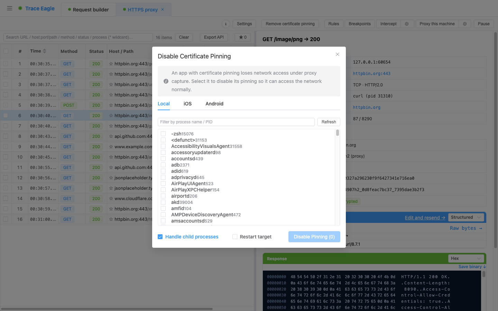

# 解除证书绑定（去 Pin）

> 有些 App 做了**证书绑定**：一开代理，它就直接连不上网。解除证书绑定让它**暂停这道校验、信任代理证书**，从而能正常联网、被抓包解密。

---

## 一、它解决什么

- 证书绑定（Pinning）的 App，在代理抓包时会**无法联网**——因为它只认自己内置的证书，不接受代理的证书。
- 选中该 App，**暂停它的证书绑定**，它就能正常访问网络，其 HTTPS 也就能走代理解密了。

> **重要：去 Pin ≠ 取明文。** 它只是让 App「愿意信任代理证书」，本身不解密内容——解密仍由代理完成。如果你要的是「直接从程序内部取明文」，那是另一件事，见 [本机应用层抓包](10-应用层抓包.md)。

---

## 二、支持的目标

三类目标，分别在对应标签页操作：

- **本机程序**：列出本机进程，可多选 / 按名称或 PID 过滤。
- **iOS App**：选设备后列出 App（需开发证书重签名的 App），也可手填 bundle id。
- **Android App**：选设备（需已 root）后列出 App，也可手填包名 / 进程名 / PID。

### 两个开关
- **自动处理子进程**（本机）：有些应用由子进程收发网络请求，一并处理，避免漏抓。
- **重启目标**：先重启 App 再处理，能覆盖它**启动初期**的请求。

---

## 三、覆盖范围与诚实边界

- **覆盖**：绝大多数主流应用的证书绑定方式，包括各类常见的原生加密组件，以及 Android 上常见的绑定框架。
- **处理结果实时反馈**：成功会告诉你处理了几个目标 / 进程；若某 App 用了不常见的网络组件、暂不支持，会**明确提示**而不是让你干等。
- **少数不适用**：用 Go、Rust 编写的程序，或桌面 Java 程序，通常不适用去 Pin——若它们读取系统证书，直接把证书装进[系统 / 其信任库](18-证书管理与安装.md)即可，无需去 Pin。

---

## 四、什么时候用

- 被抓的 App 做了证书绑定、一开代理就联不上网时——在**代理会话内**选中它去 Pin。
- 想抓 App 启动初期的请求：勾「重启目标」。
- 多进程桌面应用：保持「自动处理子进程」。

---

> 返回 [代理抓包](01-代理抓包.md) · 相关：[证书管理与安装](18-证书管理与安装.md) · [本机应用层抓包](10-应用层抓包.md)
